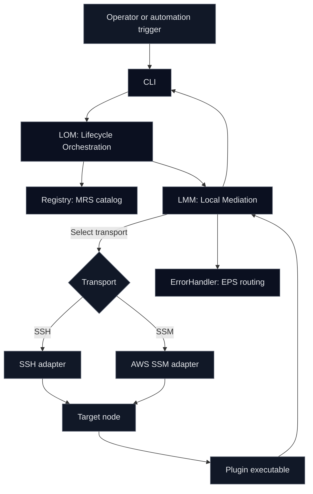

# Architecture

RUNE is built around clear separation of concerns and a strict mediation boundary. The framework executes plugins on remote Linux nodes while preserving auditability and predictable behavior.

## Components

### CLI

Operator facing entry point. The CLI:

- collects action name, target node, and parameters
- generates identifiers (message id, correlation id, trace id)
- submits an execution request to the LOM
- prints a structured response

### Lifecycle Orchestration Module (LOM)

The LOM owns lifecycle and policy. It:

- validates operator intent and input shape
- consults the module and action registry (MRS)
- prepares the runtime request envelope (RCS)
- delegates execution to the LMM

LOM is allowed to be in process for early builds. The contract is the protocol, not the process boundary.

### Local Mediation Module (LMM)

The LMM is the safety boundary. It:

- routes requests based on registry data (MRS)
- selects transport (SSH or SSM)
- enforces execution limits (timeouts, retry policy)
- invokes plugins using the plugin protocol (BPCS)
- validates plugin output
- normalizes errors into EPS and routes them to the ErrorHandler

### Transport layer

Transport implementations execute the plugin on the remote node.

- SSH transport: executes the plugin binary on the node and streams stdin and stdout
- SSM transport: executes via AWS Systems Manager where available and configured

### Plugin execution environment

The plugin is an executable on the target node. For Bash plugins, it should use the shared library that implements BPCS.

### ErrorHandler

A logical module that consumes EPS errors and produces:

- operator safe summaries
- structured logs for ingestion
- optional recovery recommendations

In the reference implementation, this can be a core component within the same process.

## System view

This diagram shows the conceptual architecture of RUNE. Early builds may run multiple modules in a single process. The protocol contracts remain the same.

## Execution flow

1. CLI creates an RCS action execution request.
2. LOM validates inputs and selects the action definition from the registry.
3. LMM selects transport and invokes the plugin on the target node.
4. Plugin receives BPCS input JSON on stdin.
5. Plugin emits one JSON object on stdout and exits with a meaningful code.
6. LMM validates output. On success it returns a structured response. On failure it emits EPS.
7. CLI prints the result.

## Protocol mapping

- RCS: CLI to LOM to LMM runtime messages
- MRS: registry entries for modules and actions
- BPCS: plugin stdin and stdout contract
- EPS: error envelopes routed to ErrorHandler

See the protocol pages for details: [RCS](rcs.md), [MRS](mrs.md), [BPCS](bpcs.md), [EPS](eps.md).

See also: [JSON appendix](json_appendix.md).
