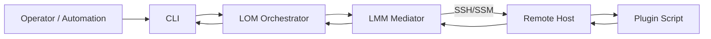
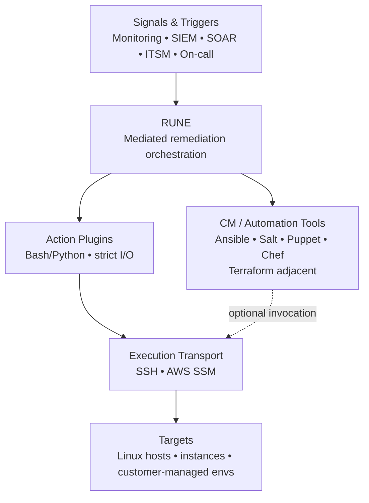
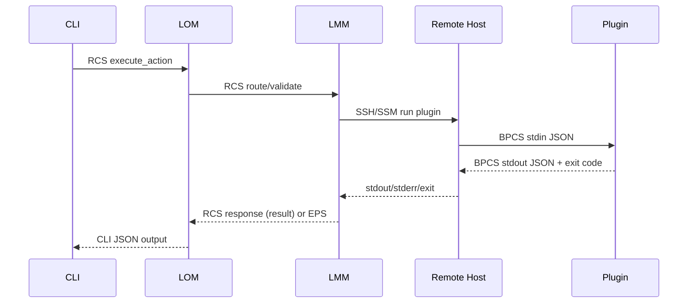
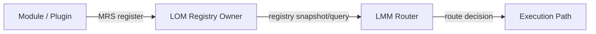
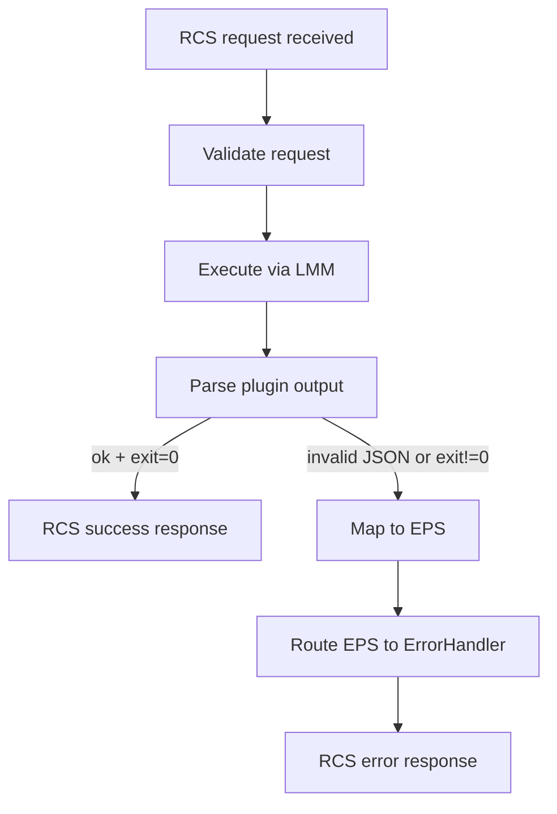
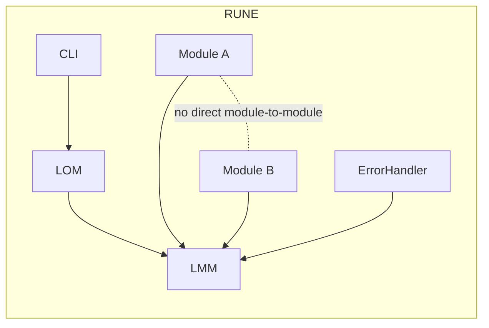
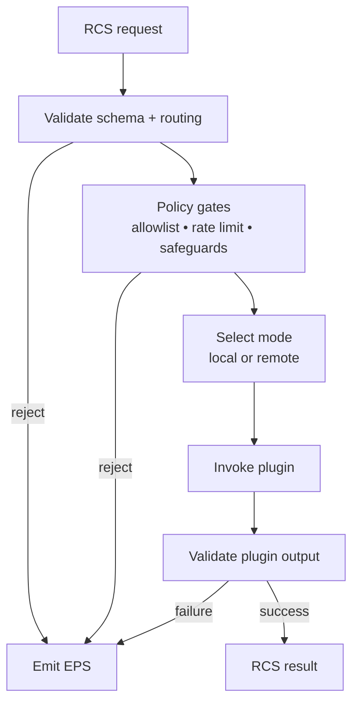
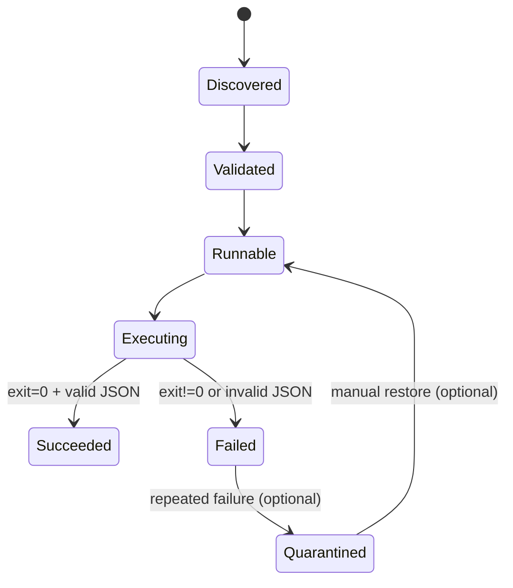

# Diagrams

This page consolidates key diagrams used throughout the documentation. Individual pages link here to avoid repeating diagrams.

## System context

## Positioning in the automation stack

## Runtime execution sequence

## Module registration flow

## Error handling flow

## Mediation boundary

## Policy gates

## Plugin lifecycle

