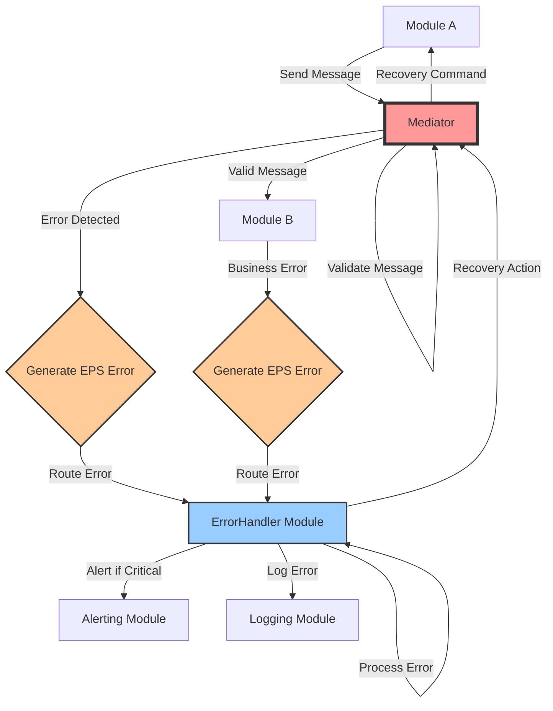
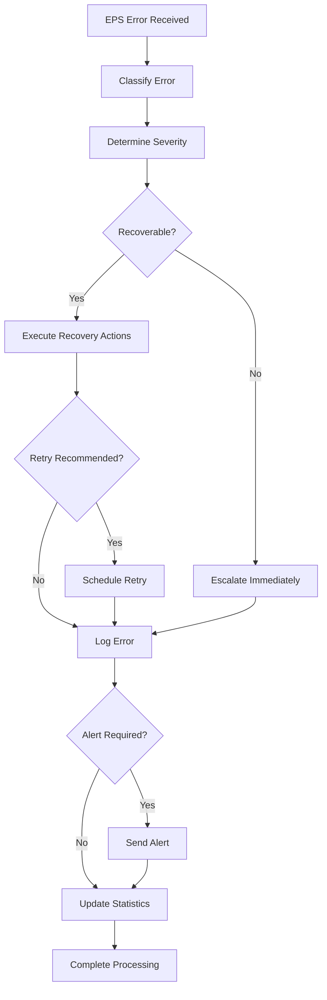

# Error Protocol Specification (EPS)

This is the canonical error envelope used by RUNE when failures must propagate through the platform and be handled consistently.

For plugin level errors, see [BPCS](bpcs.md).

## Overview

he Error Protocol Specification (EPS) defines the standardized data format for all error communication within the RUNE platform. All error reporting-whether originating from a module or a plugin-is strictly routed through the RUNE Mediator Module (LMM) to the ErrorHandler module. No direct error communication between modules, or between modules and plugins, is permitted.

EPS ensures consistent error handling, reporting, and recovery across all modules and plugins while maintaining the platform's architecture of strict mediation and loose coupling.

**All errors, whether originating from a core module or a plugin (e.g. Bash plugin), are reported via standardized EPS messages and routed exclusively through the LMM. Plugins never send error messages directly to modules or error handlers.**

<!-- /conflunce:info -->

**Key Principles:**

- **Centralized Error Routing**: All errors flow through the Mediator to registered ErrorHandler modules
- **Comprehensive Context**: Error messages include full diagnostic information for effective troubleshooting
- **Recovery Guidance**: Errors include actionable recovery recommendations
- **System Stability**: Built-in safeguards prevent error handling loops and cascading failures

## Protocol Architecture Context

The RUNE platform operates on a three-protocol architecture:

| Protocol | Purpose                                        | Managed By              | Frequency                  |
| -------- | ---------------------------------------------- | ----------------------- | -------------------------- |
| **MRS**  | Module registration and capability declaration | Orchestrator            | Low (startup/shutdown)     |
| **RCS**  | Runtime operational communication              | Mediator                | High (continuous)          |
| **EPS**  | Error handling and recovery messaging          | Mediator + ErrorHandler | Variable (exception-based) |

**Integration Points:**

- **Orchestrator**: Maintains module registry used by Mediator for error routing decisions
- **Mediator**: Routes all error messages and enforces communication protocols
- **ErrorHandler Module**: Processes errors, manages recovery, and handles escalation

## When to Use This Specification

| Use Case                                  | Protocol | Purpose                                          |
| ----------------------------------------- | -------- | ------------------------------------------------ |
| **JSON Parse Failures**                   | **EPS**  | Malformed message structure errors               |
| **Schema Validation Errors**              | **EPS**  | RCS/MRS message validation failures              |
| **Module Not Found**                      | **EPS**  | Routing failures for unregistered modules        |
| **Timeout Errors**                        | **EPS**  | Message delivery or response timeouts            |
| **Authentication/Authorization Failures** | **EPS**  | Security-related access errors                   |
| **Business Logic Errors**                 | **EPS**  | Module-specific operational failures             |
| **System Resource Errors**                | **EPS**  | Memory, disk, network, or CPU failures           |
| **Module Registration**                   | **MRS**  | Declaring capabilities and subscribing to events |
| **Operational Communication**             | **RCS**  | Normal module-to-module messaging                |

**Decision Rule:** Use EPS whenever any component detects an error condition that prevents normal message processing or operation completion.

## Error Message Structure

### Complete Format Example

```json
{
  "message_metadata": {
    "version": "1.0",
    "message_id": "550e8400-e29b-41d4-a716-446655440000",
    "correlation_id": "original-request-correlation-id",
    "parent_message_id": "original-request-message-id",
    "created_at": "2025-07-31T16:54:24.123Z",
    "priority": "high"
  },
  "routing": {
    "event_type": "EPS_ERROR_RESPONSE",
    "event_category": "error_handling",
    "source_module": "Mediator",
    "target_module": "ErrorHandler_Core",
    "original_source_module": "DataProcessor",
    "routing_tags": ["validation_error", "schema_failure"]
  },
  "error_payload": {
    "schema_version": "1.0",
    "content_type": "application/json",
    "size_bytes": 456,
    "error_data": {
      "jsonrpc": "2.0",
      "error": {
        "code": -32602,
        "message": "Invalid params",
        "data": {
          "field": "payload.data.email_address",
          "reason": "Invalid email format provided",
          "timestamp": "2025-07-31T16:54:24.123Z",
          "validation_errors": [
            "Email address must contain @ symbol",
            "Domain portion must contain at least one dot"
          ],
          "original_value": "invalid-email-format",
          "expected_format": "user@domain.com"
        }
      },
      "id": "original-request-message-id"
    },
    "error_context": {
      "error_classification": "validation_error",
      "severity": "medium",
      "recoverable": true,
      "retry_recommended": false,
      "escalation_required": false,
      "recovery_actions": [
        "Validate email format before sending",
        "Use email validation library",
        "Provide user-friendly error message"
      ],
      "related_errors": [],
      "system_impact": "single_request",
      "module_health_impact": "none"
    }
  },
  "observability": {
    "trace_id": "error-trace-001",
    "span_id": "validation-error-span",
    "error_fingerprint": "schema_validation_email_format_001"
  }
}
```

## Field Specifications

### Message Metadata Section

| Field               | Type            | Required | Purpose                                                                         |
| ------------------- | --------------- | -------- | ------------------------------------------------------------------------------- |
| `version`           | String          | **Yes**  | EPS protocol version for backward compatibility (current: "1.0")                |
| `message_id`        | UUID String     | **Yes**  | Unique identifier for this error message                                        |
| `correlation_id`    | UUID String     | **Yes**  | Links error to original request that caused the failure                         |
| `parent_message_id` | UUID String     | **Yes**  | Message ID of the original request that generated this error                    |
| `created_at`        | RFC 3339 String | **Yes**  | Error occurrence timestamp in UTC (format: YYYY-MM-DDTHH:MM:SS.sssZ)            |
| `priority`          | Enum String     | **Yes**  | Error priority: `critical`, `high`, `medium`, `low` (based on severity mapping) |

### Routing Section

| Field                    | Type          | Required | Purpose                                                 |
| ------------------------ | ------------- | -------- | ------------------------------------------------------- |
| `event_type`             | String        | **Yes**  | Always "EPS_ERROR_RESPONSE" for error protocol messages |
| `event_category`         | String        | **Yes**  | Always "error_handling" for error classification        |
| `source_module`          | String        | **Yes**  | Module that detected and generated the error            |
| `target_module`          | String        | No       | Intended recipient (usually "ErrorHandler_Core")        |
| `original_source_module` | String        | **Yes**  | Module that sent the original message causing the error |
| `routing_tags`           | Array[String] | **Yes**  | Error classification tags for routing and filtering     |

### Error Payload Section

| Field            | Type    | Required | Purpose                                                 |
| ---------------- | ------- | -------- | ------------------------------------------------------- |
| `schema_version` | String  | **Yes**  | Version of the error payload structure (current: "1.0") |
| `content_type`   | String  | **Yes**  | Always "application/json" for EPS messages              |
| `size_bytes`     | Integer | **Yes**  | Total size of error_data and error_context sections     |
| `error_data`     | Object  | **Yes**  | JSON-RPC 2.0 compliant error structure                  |
| `error_context`  | Object  | **Yes**  | RUNE-specific error context and recovery information    |

### Observability Section

| Field               | Type   | Required | Purpose                                                     |
| ------------------- | ------ | -------- | ----------------------------------------------------------- |
| `trace_id`          | String | **Yes**  | Distributed tracing identifier linking to original request  |
| `span_id`           | String | **Yes**  | Specific span identifier for this error event               |
| `error_fingerprint` | String | **Yes**  | Unique identifier for this error type for grouping/analysis |

## JSON-RPC 2.0 Error Data Structure

The `error_data` section strictly follows JSON-RPC 2.0 specification:

| Field     | Type   | Required | Purpose                                             |
| --------- | ------ | -------- | --------------------------------------------------- |
| `jsonrpc` | String | **Yes**  | Always "2.0" for JSON-RPC version compliance        |
| `error`   | Object | **Yes**  | JSON-RPC error object with code, message, data      |
| `id`      | String | **Yes**  | ID from original request (or null if not parseable) |

### JSON-RPC Error Object

| Field     | Type    | Required | Purpose                                             |
| --------- | ------- | -------- | --------------------------------------------------- |
| `code`    | Integer | **Yes**  | Numeric error code (see Standard Error Codes below) |
| `message` | String  | **Yes**  | Human-readable error description                    |
| `data`    | Object  | No       | Additional error details and context                |

### JSON-RPC Error Data Object

| Field               | Type            | Required | Purpose                                     |
| ------------------- | --------------- | -------- | ------------------------------------------- |
| `field`             | String          | No       | Specific field that caused the error        |
| `reason`            | String          | **Yes**  | Detailed explanation of the error condition |
| `timestamp`         | RFC 3339 String | **Yes**  | When the error occurred                     |
| `validation_errors` | Array[String]   | No       | List of specific validation failures        |
| `original_value`    | Any             | No       | Value that caused the error                 |
| `expected_format`   | String          | No       | Description of expected value format        |

## Standard Error Codes

### JSON-RPC 2.0 Base Codes

| Code             | Message          | Meaning                                           |
| ---------------- | ---------------- | ------------------------------------------------- |
| -32700           | Parse error      | Invalid JSON was received by the parser           |
| -32600           | Invalid Request  | The JSON sent is not a valid Request object       |
| -32601           | Method not found | The method does not exist / is not available      |
| -32602           | Invalid params   | Invalid method parameter(s)                       |
| -32603           | Internal error   | Internal JSON-RPC error                           |
| -32000 to -32099 | Server error     | Reserved for implementation-defined server-errors |

### RUNE Custom Error Codes

#### Communication Errors (-32100 to -32199)

| Code   | Message                   | Meaning                                           |
| ------ | ------------------------- | ------------------------------------------------- |
| -32100 | Module not found          | Target module is not registered with Orchestrator |
| -32101 | Module unavailable        | Target module is registered but not responding    |
| -32102 | Routing failure           | Mediator cannot determine message destination     |
| -32103 | Message too large         | Message exceeds maximum size limits               |
| -32104 | Rate limit exceeded       | Sender has exceeded message rate limits           |
| -32105 | Protocol version mismatch | Unsupported RCS/MRS/EPS version                   |

#### Validation Errors (-32200 to -32299)

| Code   | Message                    | Meaning                                     |
| ------ | -------------------------- | ------------------------------------------- |
| -32200 | Schema validation failed   | Message doesn't conform to declared schema  |
| -32201 | Required field missing     | Mandatory field is absent from message      |
| -32202 | Field type mismatch        | Field contains wrong data type              |
| -32203 | Field value out of range   | Numeric or date field exceeds allowed range |
| -32204 | Invalid field format       | Field format doesn't match specification    |
| -32205 | Checksum validation failed | Message integrity check failed              |

#### Security Errors (-32300 to -32399)

| Code   | Message                       | Meaning                                          |
| ------ | ----------------------------- | ------------------------------------------------ |
| -32300 | Authentication failed         | Invalid or missing authentication credentials    |
| -32301 | Authorization denied          | Insufficient permissions for requested operation |
| -32302 | Signature verification failed | Message signature is invalid or missing          |
| -32303 | Encryption error              | Message encryption/decryption failed             |
| -32304 | Access level insufficient     | Message requires higher access level             |
| -32305 | Token expired                 | Authentication token has expired                 |

#### System Errors (-32400 to -32499)

| Code   | Message             | Meaning                                        |
| ------ | ------------------- | ---------------------------------------------- |
| -32400 | Resource exhausted  | System resources (memory, disk, CPU) exhausted |
| -32401 | Timeout exceeded    | Operation exceeded configured timeout          |
| -32402 | Service unavailable | Required service is temporarily unavailable    |
| -32403 | Configuration error | System configuration is invalid or missing     |
| -32404 | Database error      | Database operation failed                      |
| -32405 | Network error       | Network connectivity or operation failed       |

#### Business Logic Errors (-32500 to -32599)

| Code   | Message                 | Meaning                                         |
| ------ | ----------------------- | ----------------------------------------------- |
| -32500 | Business rule violation | Operation violates business logic constraints   |
| -32501 | Workflow state invalid  | Operation not allowed in current workflow state |
| -32502 | Data consistency error  | Operation would violate data consistency        |
| -32503 | Dependency unsatisfied  | Required dependency is not available            |
| -32504 | Operation not permitted | Operation is not allowed for this entity        |
| -32505 | Quota exceeded          | User or module has exceeded usage quota         |

## Error Classification and Severity

### Error Classification Types

| Classification        | Description                              | Typical Codes    | Recovery Approach                          |
| --------------------- | ---------------------------------------- | ---------------- | ------------------------------------------ |
| `validation_error`    | Data format or schema violations         | -32200 to -32299 | Fix data and retry                         |
| `communication_error` | Message routing or delivery failures     | -32100 to -32199 | Check module status, retry                 |
| `security_error`      | Authentication or authorization failures | -32300 to -32399 | Update credentials, check permissions      |
| `system_error`        | Infrastructure or resource failures      | -32400 to -32499 | Check system health, scale resources       |
| `business_error`      | Application logic violations             | -32500 to -32599 | Review business rules, adjust request      |
| `protocol_error`      | JSON-RPC or EPS protocol violations      | -32700 to -32099 | Fix message format, check protocol version |

### Severity Levels

| Severity   | Priority | Description                          | Response Time | Escalation |
| ---------- | -------- | ------------------------------------ | ------------- | ---------- |
| `critical` | critical | System-wide failure, data loss risk  | Immediate     | Automatic  |
| `high`     | high     | Module failure, significant impact   | < 5 minutes   | Automatic  |
| `medium`   | medium   | Feature degradation, partial failure | < 30 minutes  | Manual     |
| `low`      | low      | Minor issues, validation errors      | < 2 hours     | None       |

### Recovery Guidance

| Error Context Field    | Purpose                             | Values                                                        |
| ---------------------- | ----------------------------------- | ------------------------------------------------------------- |
| `recoverable`          | Can the operation be retried?       | `true`, `false`                                               |
| `retry_recommended`    | Should retry be attempted?          | `true`, `false`                                               |
| `escalation_required`  | Does this need human intervention?  | `true`, `false`                                               |
| `system_impact`        | How much of the system is affected? | `single_request`, `module`, `multiple_modules`, `system_wide` |
| `module_health_impact` | How does this affect module health? | `none`, `degraded`, `critical`, `failed`                      |

## Error Flow Architecture



### Error Detection Points

1. **Mediator Validation**: JSON parsing, schema validation, routing errors
2. **Module Processing**: Business logic errors, resource failures
3. **System Level**: Infrastructure failures, timeouts, security violations

### Error Routing Rules

1. **All errors** are formatted using EPS protocol
2. **All errors** are routed through Mediator (no direct communication)
3. **ErrorHandler module** is the primary error processor
4. **Original sender** receives error response via Mediator
5. **Critical errors** trigger automatic escalation workflows

## Recovery and Escalation

### Automatic Recovery Actions

| Error Type              | Recovery Action              | Trigger Condition             |
| ----------------------- | ---------------------------- | ----------------------------- |
| `Module unavailable`    | Health check, restart module | Module not responding         |
| `Rate limit exceeded`   | Queue message, retry later   | Rate limit threshold reached  |
| `Resource exhausted`    | Scale resources, alert ops   | Memory/CPU/disk thresholds    |
| `Authentication failed` | Refresh credentials          | Token expired                 |
| `Timeout exceeded`      | Retry with backoff           | Network or processing timeout |

### Escalation Matrix

| Severity     | Time Window | Actions                                            |
| ------------ | ----------- | -------------------------------------------------- |
| **Critical** | Immediate   | Alert on-call, auto-recovery, emergency procedures |
| **High**     | 5 minutes   | Page team lead, initiate recovery, status update   |
| **Medium**   | 30 minutes  | Email notification, schedule review, monitor       |
| **Low**      | 2 hours     | Log for review, include in reports                 |

## Example Error Messages

### Schema Validation Error

```json
{
  "message_metadata": {
    "version": "1.0",
    "message_id": "550e8400-e29b-41d4-a716-446655440001",
    "correlation_id": "email-workflow-001",
    "parent_message_id": "550e8400-e29b-41d4-a716-446655440000",
    "created_at": "2025-07-31T16:54:24.234Z",
    "priority": "medium"
  },
  "routing": {
    "event_type": "EPS_ERROR_RESPONSE",
    "event_category": "error_handling",
    "source_module": "Mediator",
    "target_module": "ErrorHandler_Core",
    "original_source_module": "EmailSender",
    "routing_tags": ["validation_error", "schema_failure", "email"]
  },
  "error_payload": {
    "schema_version": "1.0",
    "content_type": "application/json",
    "size_bytes": 387,
    "error_data": {
      "jsonrpc": "2.0",
      "error": {
        "code": -32200,
        "message": "Schema validation failed",
        "data": {
          "field": "payload.data.recipient",
          "reason": "Email address format is invalid",
          "timestamp": "2025-07-31T16:54:24.234Z",
          "validation_errors": [
            "Missing @ symbol in email address",
            "Domain must contain at least one dot"
          ],
          "original_value": "user-invalid-email",
          "expected_format": "user@domain.com"
        }
      },
      "id": "550e8400-e29b-41d4-a716-446655440000"
    },
    "error_context": {
      "error_classification": "validation_error",
      "severity": "medium",
      "recoverable": true,
      "retry_recommended": false,
      "escalation_required": false,
      "recovery_actions": [
        "Validate email format using regex or validation library",
        "Provide user with format example",
        "Implement client-side validation"
      ],
      "related_errors": [],
      "system_impact": "single_request",
      "module_health_impact": "none"
    }
  },
  "observability": {
    "trace_id": "email-workflow-trace-001",
    "span_id": "email-validation-error",
    "error_fingerprint": "email_validation_format_001"
  }
}
```

### Module Not Found Error

```json
{
  "message_metadata": {
    "version": "1.0",
    "message_id": "550e8400-e29b-41d4-a716-446655440002",
    "correlation_id": "data-processing-workflow-001",
    "parent_message_id": "550e8400-e29b-41d4-a716-446655440001",
    "created_at": "2025-07-31T16:54:24.345Z",
    "priority": "high"
  },
  "routing": {
    "event_type": "EPS_ERROR_RESPONSE",
    "event_category": "error_handling",
    "source_module": "Mediator",
    "target_module": "ErrorHandler_Core",
    "original_source_module": "DataOrchestrator",
    "routing_tags": [
      "communication_error",
      "module_not_found",
      "routing_failure"
    ]
  },
  "error_payload": {
    "schema_version": "1.0",
    "content_type": "application/json",
    "size_bytes": 298,
    "error_data": {
      "jsonrpc": "2.0",
      "error": {
        "code": -32100,
        "message": "Module not found",
        "data": {
          "field": "routing.target_module",
          "reason": "Requested module 'AdvancedAnalytics' is not registered",
          "timestamp": "2025-07-31T16:54:24.345Z",
          "original_value": "AdvancedAnalytics",
          "expected_format": "Registered module name from Orchestrator registry"
        }
      },
      "id": "550e8400-e29b-41d4-a716-446655440001"
    },
    "error_context": {
      "error_classification": "communication_error",
      "severity": "high",
      "recoverable": true,
      "retry_recommended": true,
      "escalation_required": true,
      "recovery_actions": [
        "Check module registration status with Orchestrator",
        "Verify module is running and healthy",
        "Use alternative module if available",
        "Trigger module startup if configured"
      ],
      "related_errors": [],
      "system_impact": "multiple_modules",
      "module_health_impact": "degraded"
    }
  },
  "observability": {
    "trace_id": "data-processing-trace-001",
    "span_id": "module-routing-error",
    "error_fingerprint": "module_not_found_advanced_analytics_001"
  }
}
```

### Critical System Error

```json
{
  "message_metadata": {
    "version": "1.0",
    "message_id": "550e8400-e29b-41d4-a716-446655440003",
    "correlation_id": "system-monitor-001",
    "parent_message_id": "550e8400-e29b-41d4-a716-446655440002",
    "created_at": "2025-07-31T16:54:24.456Z",
    "priority": "critical"
  },
  "routing": {
    "event_type": "EPS_ERROR_RESPONSE",
    "event_category": "error_handling",
    "source_module": "SystemMonitor",
    "target_module": "ErrorHandler_Core",
    "original_source_module": "DataProcessor",
    "routing_tags": ["system_error", "resource_exhausted", "critical_failure"]
  },
  "error_payload": {
    "schema_version": "1.0",
    "content_type": "application/json",
    "size_bytes": 445,
    "error_data": {
      "jsonrpc": "2.0",
      "error": {
        "code": -32400,
        "message": "Resource exhausted",
        "data": {
          "field": "system.memory",
          "reason": "Available memory below critical threshold",
          "timestamp": "2025-07-31T16:54:24.456Z",
          "original_value": "95% memory usage",
          "expected_format": "Memory usage below 85%"
        }
      },
      "id": "550e8400-e29b-41d4-a716-446655440002"
    },
    "error_context": {
      "error_classification": "system_error",
      "severity": "critical",
      "recoverable": true,
      "retry_recommended": false,
      "escalation_required": true,
      "recovery_actions": [
        "Stop non-critical modules immediately",
        "Clear system caches",
        "Scale up infrastructure resources",
        "Alert operations team for immediate intervention"
      ],
      "related_errors": [],
      "system_impact": "system_wide",
      "module_health_impact": "critical"
    }
  },
  "observability": {
    "trace_id": "system-critical-trace-001",
    "span_id": "memory-exhaustion-error",
    "error_fingerprint": "system_memory_critical_001"
  }
}
```

## Error Handler Module Integration

### ErrorHandler Module Registration (MRS)

```json
{
  "module_identity": {
    "module_name": "ErrorHandler_Core",
    "module_class": "CentralizedErrorProcessor",
    "module_type": "error_management_service",
    "module_version": "1.0.0",
    "description": "Centralized error processing, recovery management, and escalation handling",
    "registration_timestamp": "2025-07-31T16:54:24.567Z"
  },
  "capability_declaration": {
    "provides_events": [
      "ERROR_PROCESSED",
      "MODULE_RECOVERY_INITIATED",
      "ERROR_ALERT_GENERATED",
      "ERROR_STATISTICS_UPDATED"
    ],
    "consumes_events": ["EPS_ERROR_RESPONSE"]
  },
  "technical_requirements": {
    "supported_protocols": ["rcs_v2"],
    "resource_requirements": {
      "min_memory_mb": 512,
      "max_memory_mb": 2048,
      "cpu_cores": 2,
      "instance_count": 1
    }
  }
}
```

### ErrorHandler Processing Workflow



## Minimal Required Error Message

The absolute minimum valid EPS error message:

```json
{
  "message_metadata": {
    "version": "1.0",
    "message_id": "550e8400-e29b-41d4-a716-446655440004",
    "correlation_id": "unknown",
    "parent_message_id": "unknown",
    "created_at": "2025-07-31T16:54:24.678Z",
    "priority": "medium"
  },
  "routing": {
    "event_type": "EPS_ERROR_RESPONSE",
    "event_category": "error_handling",
    "source_module": "Mediator",
    "original_source_module": "unknown",
    "routing_tags": ["parse_error"]
  },
  "error_payload": {
    "schema_version": "1.0",
    "content_type": "application/json",
    "size_bytes": 156,
    "error_data": {
      "jsonrpc": "2.0",
      "error": {
        "code": -32700,
        "message": "Parse error",
        "data": {
          "reason": "Invalid JSON received",
          "timestamp": "2025-07-31T16:54:24.678Z"
        }
      },
      "id": null
    },
    "error_context": {
      "error_classification": "protocol_error",
      "severity": "medium",
      "recoverable": false,
      "retry_recommended": false,
      "escalation_required": false,
      "recovery_actions": ["Fix JSON format and resend"],
      "system_impact": "single_request",
      "module_health_impact": "none"
    }
  },
  "observability": {
    "trace_id": "parse-error-trace-001",
    "span_id": "json-parse-failure",
    "error_fingerprint": "json_parse_error_001"
  }
}
```

## Implementation Guidelines

### Module Error Response Template

```typescript
abstract class RUNEModule {
  protected generateEPSError(
    originalMessage: RCSMessage | null,
    errorCode: number,
    errorMessage: string,
    errorDetails: any = {},
  ): EPSMessage {
    return {
      message_metadata: {
        version: "1.0",
        message_id: generateUUID(),
        correlation_id:
          originalMessage?.message_metadata?.correlation_id || "unknown",
        parent_message_id:
          originalMessage?.message_metadata?.message_id || "unknown",
        created_at: new Date().toISOString(),
        priority: this.determinePriority(errorCode),
      },
      routing: {
        event_type: "EPS_ERROR_RESPONSE",
        event_category: "error_handling",
        source_module: this.moduleName,
        target_module: "ErrorHandler_Core",
        original_source_module:
          originalMessage?.routing?.source_module || "unknown",
        routing_tags: this.generateErrorTags(errorCode, errorDetails),
      },
      error_payload: {
        schema_version: "1.0",
        content_type: "application/json",
        size_bytes: 0, // Calculate after serialization
        error_data: {
          jsonrpc: "2.0",
          error: {
            code: errorCode,
            message: errorMessage,
            data: {
              reason: errorDetails.reason || errorMessage,
              timestamp: new Date().toISOString(),
              ...errorDetails,
            },
          },
          id: originalMessage?.message_metadata?.message_id || null,
        },
        error_context: this.buildErrorContext(errorCode, errorDetails),
      },
      observability: {
        trace_id: originalMessage?.observability?.trace_id || generateTraceId(),
        span_id: generateSpanId(),
        error_fingerprint: this.generateErrorFingerprint(
          errorCode,
          errorDetails,
        ),
      },
    };
  }
}
```

### Error Classification Logic

```typescript
class ErrorClassifier {
  static classifyError(errorCode: number): ErrorContext {
    if (errorCode >= -32099 && errorCode <= -32000) {
      return { classification: "protocol_error", severity: "medium" };
    } else if (errorCode >= -32199 && errorCode <= -32100) {
      return { classification: "communication_error", severity: "high" };
    } else if (errorCode >= -32299 && errorCode <= -32200) {
      return { classification: "validation_error", severity: "medium" };
    } else if (errorCode >= -32399 && errorCode <= -32300) {
      return { classification: "security_error", severity: "high" };
    } else if (errorCode >= -32499 && errorCode <= -32400) {
      return { classification: "system_error", severity: "critical" };
    } else if (errorCode >= -32599 && errorCode <= -32500) {
      return { classification: "business_error", severity: "medium" };
    }
    return { classification: "unknown_error", severity: "medium" };
  }
}
```

## Safety Mechanisms

### Infinite Loop Prevention

1. **ErrorHandler Isolation**: ErrorHandler module cannot process its own errors
2. **Circuit Breaker**: Maximum error processing rate per time window
3. **Fallback Logging**: Critical errors logged directly if ErrorHandler unavailable
4. **Error Budget**: Maximum errors per module before automatic intervention

### Error Processing Limits

```json
{
  "error_safety_config": {
    "max_errors_per_minute": 100,
    "max_errors_per_module_per_minute": 20,
    "circuit_breaker_threshold": 50,
    "circuit_breaker_timeout_seconds": 300,
    "fallback_logging_enabled": true,
    "error_handler_isolation": true
  }
}
```

### Critical Error Bypass

```typescript
class Mediator {
  handleCriticalError(error: Error, sourceModule: string) {
    // SAFETY: Never route ErrorHandler's own errors back to ErrorHandler
    if (sourceModule === "ErrorHandler_Core") {
      this.logCriticalErrorDirectly(error);
      this.triggerEmergencyProcedures(error);
      return;
    }

    // SAFETY: Circuit breaker check
    if (this.errorRateExceeded()) {
      this.logCriticalErrorDirectly(error);
      this.triggerCircuitBreaker();
      return;
    }

    // Normal error processing
    this.routeErrorToHandler(error, sourceModule);
  }
}
```

## Implementation Notes

1. **Timestamps**: All timestamps must be in RFC 3339 format with UTC timezone
2. **UUIDs**: Use UUID v4 for all identifier fields
3. **Error Fingerprinting**: Create consistent fingerprints for error grouping and analysis
4. **Size Calculation**: `size_bytes` must be calculated after JSON serialization
5. **Priority Mapping**: Error code ranges automatically determine message priority
6. **Trace Continuity**: Always preserve trace_id from original request for observability
7. **Recovery Actions**: Provide specific, actionable recovery recommendations
8. **Classification Consistency**: Use standard error classification types for proper routing

This Error Protocol Specification ensures robust, consistent error handling across the RUNE platform while maintaining architectural principles of modularity, observability, and system stability.
