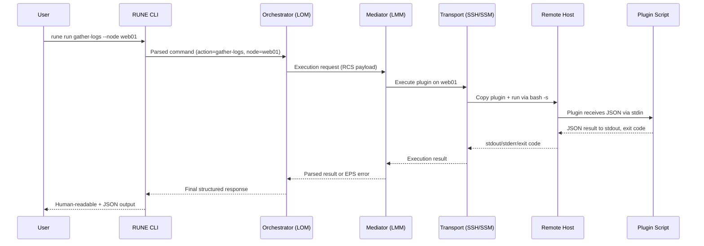

# RUNE Implementation & Deployment Guide

This document explains how RUNE actually runs in the real world:

- Where the RUNE core lives
- How it’s installed from PyPI
- How plugins are stored, shipped, and executed on remote hosts
- What a typical control-node + fleet setup looks like

This is the “how do I wire this up so it does real work” guide.

---

## 1. Deployment Model

### 1.1 Control Node vs Remote Nodes

RUNE uses a **control-node** model:

- **RUNE Core (Python)**
  Installed on a single control node (or a small HA set):

  - SoC tooling server
  - Jump/bastion host
  - Admin workstation

- **Remote Nodes (Linux endpoints)**

  - No RUNE Python package installed
  - Only requirements:

    - SSH access (or SSM for cloud nodes)
    - `/bin/bash` (for MVP Bash plugins)
    - Standard system tools (tar, journalctl, systemctl, etc. depending on plugins)

RUNE sends plugins to remote nodes and executes them there; all orchestration, mediation, and logging stay on the control node.

---

## 2. Installation from PyPI

### 2.1 Basic Install

On the control node:

```bash
pip install rune-cli
```

This provides:

- A Python package: `rune`
- A console script: `rune` (installed into your venv or system bin)

Check it’s available:

```bash
rune --help
```

### 2.2 Package Layout (Control Node)

After install, you can expect something like:

```text
rune/
  __init__.py
  cli.py              # CLI entrypoint
  core/
    orchestrator.py   # RUNE Orchestrator (LOM)
    mediator.py       # RUNE Mediator (LMM)
  transports/
    ssh.py            # SSH-based execution
    ssm.py            # Optional AWS SSM-based execution
  plugins/
    builtin/
      gather_logs.sh
      restart_docker.sh
      restart_nomad.sh
      noop.sh
  models/
    rcs.py            # Runtime Communication Spec models
    eps.py            # Error Protocol models
    mrs.py            # Module Registration models
  config/
    defaults.py
```

You may adjust exact paths, but the idea stands: **control-node only**, with a clearly defined transport layer and plugin bundle.

---

## 3. Runtime Directories & Config

RUNE uses standard XDG-style locations (MVP can be simplified if you want).

### 3.1 Config

Default locations (in order):

1. `./rune.toml` (project-local)
2. `~/.config/rune/config.toml`
3. `/etc/rune/config.toml` (system-wide)

Example minimal `config.toml`:

```toml
[core]
default_transport = "ssh"
default_user = "admin"

[ssh]
private_key = "/home/admin/.ssh/id_ed25519"
known_hosts = "/home/admin/.ssh/known_hosts"

[plugins]
# Local paths to plugin scripts on the control node
plugin_dir = "/opt/rune/plugins"
```

### 3.2 Local Plugin Storage

RUNE looks for plugins in:

1. `plugins/builtin/` inside the package (shipped with RUNE)
2. `~/.local/share/rune/plugins/`
3. `/opt/rune/plugins/` (or whatever `plugin_dir` is set to)

You can drop custom scripts in any of those locations and wire them in via config/registry.

---

## 4. How Remote Plugins Are Actually Run

Here’s the core of the system: **how an action like**:

```bash
rune run gather-logs --node web01
```

turns into code running on `web01`.

### 4.1 High-Level Flow



### 4.2 Plugin Shipping Strategy (MVP)

MVP behavior (simplest, least assumptions):

1. **On the control node**, RUNE loads the plugin script from its local `plugins/` directory.
2. RUNE opens a remote session via the configured transport:

   - SSH: `ssh user@web01`
   - SSM: `aws ssm send-command ...` (future)

3. RUNE **copies the plugin** to the remote host, typically to:

   - `/tmp/rune/plugins/gather-logs.sh`

4. RUNE sets perms:

   ```bash
   chmod +x /tmp/rune/plugins/gather-logs.sh
   ```

5. RUNE runs the plugin remotely with JSON piped to stdin:

   ```bash
   echo '<JSON-RCS-PAYLOAD>' | /tmp/rune/plugins/gather-logs.sh
   ```

6. The plugin:

   - Reads JSON from stdin
   - Performs its task
   - Writes structured JSON to stdout
   - Exits with appropriate code

7. RUNE captures `stdout`, `stderr`, and exit code; the Mediator validates and normalizes them.
8. (Optional) RUNE cleans up:

   - Remove `/tmp/rune/plugins/gather-logs.sh`
   - Or keep a cache per-node for repeat runs

This default “ship and run” mode means **you do not need to pre-install anything** on remote hosts beyond bash and SSH/SSM.

---

## 5. Pre-Installed Plugin Mode (Future/Optional)

In more controlled environments, you may want plugins **pre-installed** on all hosts (via Ansible, Salt, etc.).

In that mode:

- RUNE does **not** copy scripts to remote nodes.

- Instead, it executes a known path:

  ```bash
  echo '<JSON>' | /usr/local/lib/rune/plugins/gather-logs.sh
  ```

- The plugin location is configurable:

  ```toml
  [remote_plugins]
  base_dir = "/usr/local/lib/rune/plugins"
  ```

- RUNE just ensures the plugin name maps to a file path on the remote system.

MVP can support this with a simple config switch:

```toml
[execution]
deploy_mode = "ship"    # or "preinstalled"
```

---

## 6. RUNE Core: Where It Lives and What It Does

### 6.1 Core is Centralized

The RUNE core:

- Lives on the control node
- Is installed as a Python package
- Owns:

  - CLI interface (`rune`)
  - Orchestrator (LOM)
  - Mediator (LMM)
  - Transport modules
  - Protocol models (RCS, EPS, MRS)
  - Logging and observability hooks

Remote nodes are **dumb execution environments**.

### 6.2 Orchestrator (LOM) Responsibilities

- Validate action name and target
- Resolve which plugin to use
- Build standardized RCS payload:

  ```json
  {
    "message_metadata": {...},
    "routing": {...},
    "payload": {
      "schema_version": "rcs_v1",
      "data": {
        "input_parameters": {...}
      }
    }
  }
  ```

- Hand off to Mediator for execution

### 6.3 Mediator (LMM) Responsibilities

- Call the appropriate transport (SSH or SSM)
- Ship plugin (if `deploy_mode = ship`)
- Execute plugin remotely
- Capture:

  - `stdout` (expected JSON)
  - `stderr` (debug/log)
  - exit code

- Parse JSON and:

  - On success → return normalized result
  - On failure → wrap in EPS error object

---

## 7. Example: End-to-End Setup

### 7.1 Control Node Setup

```bash
# Install RUNE
pip install rune-cli

# Optional: create config
mkdir -p ~/.config/rune
cat > ~/.config/rune/config.toml <<EOF
[core]
default_transport = "ssh"
default_user = "admin"

[ssh]
private_key = "/home/admin/.ssh/id_ed25519"

[plugins]
plugin_dir = "/opt/rune/plugins"
EOF
```

### 7.2 Add a Custom Plugin (Control Node)

```bash
sudo mkdir -p /opt/rune/plugins
sudo tee /opt/rune/plugins/check-disk.sh >/dev/null <<'EOF'
#!/bin/bash
set -euo pipefail
INPUT=$(cat)
# Simple example ignoring input
USE=$(df -h / | awk 'NR==2 {print $5}')
cat <<JSON
{
  "message_metadata": {},
  "payload": {
    "result": "success",
    "output_data": {
      "disk_usage": "$USE"
    }
  },
  "error": null
}
JSON
EOF

sudo chmod +x /opt/rune/plugins/check-disk.sh
```

Update config mapping if you introduce explicit registry later; for MVP, RUNE can infer from filename → action.

### 7.3 Running an Action

```bash
rune run gather-logs --node web01 --output pretty
rune run restart-docker --node web02
rune run check-disk --node db01 --output json
```

---

## 8. Files & Directories Summary

| Location                      | Purpose                            |
| ----------------------------- | ---------------------------------- |
| `rune/` (Python package)      | Core orchestrator/mediator logic   |
| `rune/plugins/builtin/`       | Built-in plugins shipped with RUNE |
| `~/.config/rune/config.toml`  | User-level config                  |
| `/etc/rune/config.toml`       | System-level config                |
| `/opt/rune/plugins/`          | Custom/local plugins               |
| `/tmp/rune/plugins/` (remote) | Shipped plugin scripts on targets  |
| `site/` (local)               | Built MkDocs site                  |
| `gh-pages` branch             | Deployed docs for GitHub Pages     |

---

## 9. What Changes When Someone `pip install rune-cli`?

Once a developer or operator installs the `rune-cli` package on a control node:

1. They get the `rune` CLI.
2. They get a default set of built-in plugins and protocols.
3. They only need:

   - SSH/SSM access to their Linux fleet
   - Valid config

4. They can immediately run:

   ```bash
   rune run noop --node some-host
   ```

   and start wiring RUNE into:

   - SoC dashboards
   - CI/CD pipelines
   - Runbooks

No agents. No daemons. RUNE core lives in one place and **reaches out** to do the dirty work.

© 2025 Richard Majewski. Licensed under the MPL-2.0.
