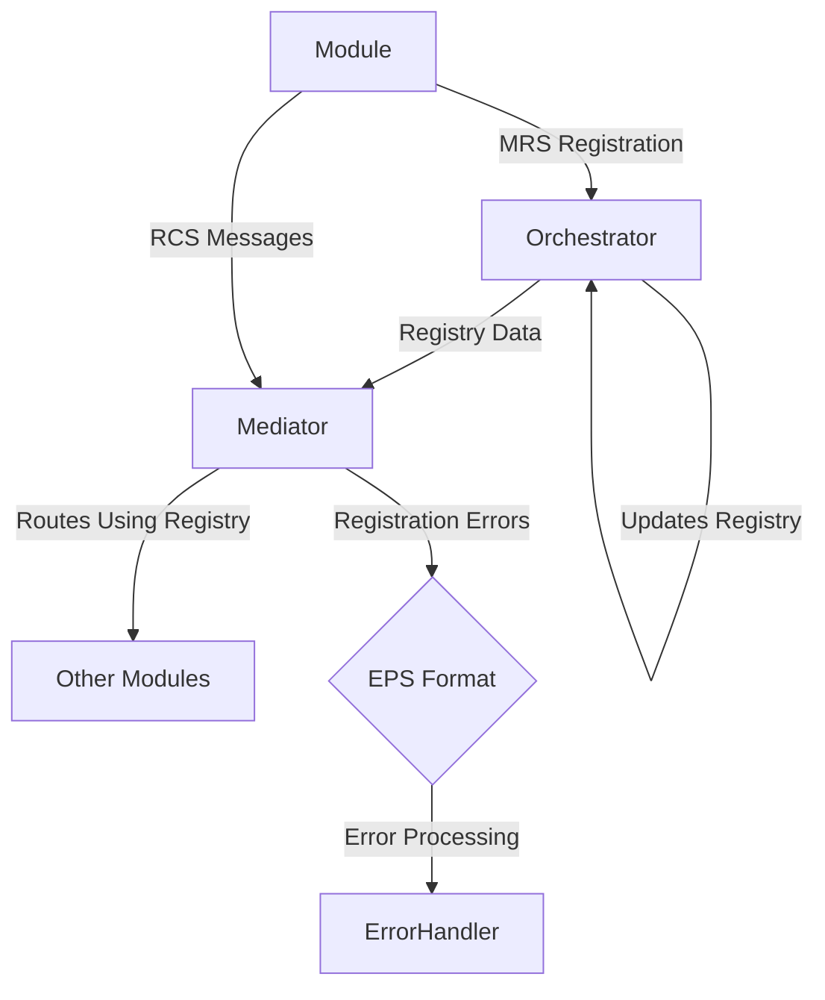
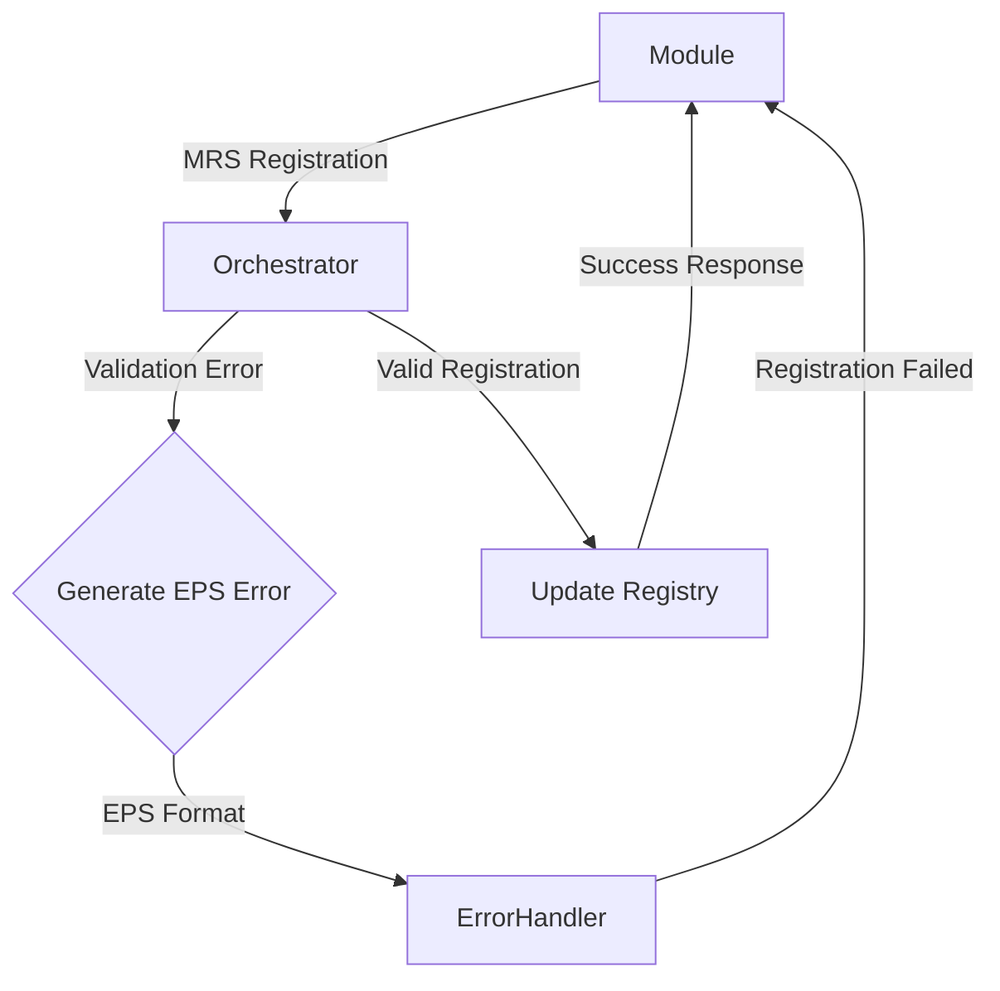

# Module Registration Specification (MRS)

This is the canonical module and capability registration specification used by RUNE to build a registry for routing, discovery, and policy.

For operational context, see [Lifecycle model](lifecycle.md).

## Overview

This document defines the standardized data format for module registration and capability declaration within the RUNE platform. This format enables dynamic module discovery and eliminates hardcoded assumptions about module capabilities.

Unlike the Runtime Communication Specification (RCS) which prioritizes lightweight messaging for high-frequency operations, the MRS is designed for comprehensive capability declaration during module startup and topology changes. For error handling and recovery messaging, see the Error Protocol Specification (EPS).

**Key Principles:**

- **Dynamic Discovery**: Zero hardcoded module types or capabilities
- **Self-Description**: Modules completely define their own identity and services
- **Schema Declaration**: Event types include full schema definitions
- **Separation of Concerns**: Registration data separate from runtime messaging

## Protocol Architecture Context

The RUNE platform operates on a three-protocol architecture that ensures separation of concerns and optimal performance:

| Protocol | Purpose                                        | Managed By              | Frequency                  | Use Case                          |
| -------- | ---------------------------------------------- | ----------------------- | -------------------------- | --------------------------------- |
| **MRS**  | Module registration and capability declaration | Orchestrator            | Low (startup/shutdown)     | Module lifecycle management       |
| **RCS**  | Runtime operational communication              | Mediator                | High (continuous)          | Normal module-to-module messaging |
| **EPS**  | Error handling and recovery messaging          | Mediator + ErrorHandler | Variable (exception-based) | Error responses and recovery      |

**Architecture Integration:**

- **Orchestrator**: Maintains module registry built from MRS registrations
- **Mediator**: Uses Orchestrator's registry for RCS message routing decisions
- **ErrorHandler**: Processes EPS messages for registration errors and recovery

**Communication Flow:**



## When to Use This Specification

| Use Case                           | Specification | Purpose                                                  |
| ---------------------------------- | ------------- | -------------------------------------------------------- |
| **Module Registration**            | **MRS**       | Declaring module capabilities and subscribing to events  |
| **Capability Updates**             | **MRS**       | Updating module event schemas or dependencies            |
| **Module Deregistration**          | **MRS**       | Graceful shutdown and capability removal                 |
| **Registration Errors**            | **EPS**       | Registration validation failures, dependency errors      |
| **Module-to-Module Communication** | **RCS**       | Runtime operational messaging between registered modules |
| **Request-Response Patterns**      | **RCS**       | Synchronous and asynchronous communication workflows     |
| **Event Publishing/Subscribing**   | **RCS**       | Broadcasting events to interested modules                |
| **Health Check Responses**         | **RCS**       | Responding to orchestrator health checks                 |

**Decision Rule:** Use MRS only for registration and capability management. Use RCS for all operational communication after modules are registered. Use EPS for all error conditions during registration or runtime.

**Cross-Protocol References:**

- See [Runtime Communication Specification (RCS)](./rcs.md) for operational messaging
- See [Error Protocol Specification (EPS)](./eps.md) for error handling and recovery messaging

## Registration Message Structure

### Complete Format Example

```json
{
  "module_identity": {
    "module_name": "EmailAlerter_Primary",
    "module_class": "EmailNotificationService",
    "module_type": "alerting_service",
    "module_version": "2.1.3",
    "description": "Advanced email notification service with templating and retry logic",
    "registration_timestamp": "2025-07-31T17:47:53.123Z"
  },
  "capability_declaration": {
    "provides_events": [
      {
        "event_type": "EMAIL_SENT",
        "description": "Published when email is successfully delivered",
        "data_schema": {
          "type": "object",
          "properties": {
            "message_id": { "type": "string" },
            "recipient": { "type": "string", "format": "email" },
            "subject": { "type": "string" },
            "delivery_timestamp": { "type": "string", "format": "date-time" },
            "smtp_response": { "type": "string" }
          },
          "required": ["message_id", "recipient", "delivery_timestamp"]
        },
        "example_data": {
          "message_id": "msg_550e8400e29b41d4",
          "recipient": "admin@example.com",
          "subject": "System Alert: High CPU Usage",
          "delivery_timestamp": "2025-07-31T17:47:53.456Z",
          "smtp_response": "250 2.0.0 Ok: queued as 12345"
        },
        "schema_version": "1.2",
        "backward_compatible": true
      },
      {
        "event_type": "EMAIL_DELIVERY_FAILED",
        "description": "Published when email delivery fails after all retries",
        "data_schema": {
          "type": "object",
          "properties": {
            "message_id": { "type": "string" },
            "recipient": { "type": "string", "format": "email" },
            "error_code": { "type": "string" },
            "error_message": { "type": "string" },
            "retry_count": { "type": "integer" },
            "final_attempt_timestamp": {
              "type": "string",
              "format": "date-time"
            }
          },
          "required": ["message_id", "recipient", "error_code", "retry_count"]
        },
        "example_data": {
          "message_id": "msg_550e8400e29b41d4",
          "recipient": "invalid@nonexistent.com",
          "error_code": "550",
          "error_message": "Recipient address rejected: User unknown",
          "retry_count": 3,
          "final_attempt_timestamp": "2025-07-31T17:50:53.789Z"
        },
        "schema_version": "1.1",
        "backward_compatible": true
      }
    ],
    "consumes_events": [
      "SEND_EMAIL",
      "SEND_NOTIFICATION",
      "RENDER_EMAIL_TEMPLATE"
    ],
    "service_metadata": {
      "smtp_server": "smtp.company.com",
      "max_concurrent_sends": 10,
      "retry_attempts": 3,
      "supported_formats": ["text", "html", "multipart"],
      "template_engine": "jinja2",
      "authentication_method": "oauth2",
      "encryption_support": ["tls", "ssl"],
      "rate_limit_per_hour": 1000
    }
  },
  "technical_requirements": {
    "supported_protocols": ["rcs_v2"],
    "dependencies": [
      {
        "module_name": "ConfigurationManager",
        "version_requirement": ">=2.0.0",
        "criticality": "required"
      },
      {
        "module_name": "LoggingModule",
        "version_requirement": ">=1.5.0",
        "criticality": "optional"
      }
    ],
    "resource_requirements": {
      "min_memory_mb": 256,
      "max_memory_mb": 1024,
      "cpu_cores": 2,
      "disk_space_mb": 100,
      "network_bandwidth_mbps": 10,
      "instance_count": 1
    },
    "health_check_endpoint": {
      "event_type": "EMAIL_SERVICE_HEALTH_CHECK",
      "expected_response": "EMAIL_SERVICE_HEALTH_RESPONSE",
      "timeout_ms": 5000,
      "check_interval_seconds": 30
    },
    "configuration_schema": {
      "type": "object",
      "properties": {
        "smtp_host": { "type": "string" },
        "smtp_port": { "type": "integer", "minimum": 1, "maximum": 65535 },
        "username": { "type": "string" },
        "password": { "type": "string" },
        "from_address": { "type": "string", "format": "email" }
      },
      "required": ["smtp_host", "smtp_port", "from_address"]
    }
  },
  "registration_metadata": {
    "registration_id": "550e8400-e29b-41d4-a716-446655440000",
    "registration_version": "1.0",
    "expires_at": "2025-07-31T18:47:53.123Z",
    "update_mode": "replace",
    "registration_source": "module_startup",
    "previous_registration_id": null,
    "orchestrator_acknowledgment_required": true
  }
}
```

## Field Specifications

### Module Identity Section

| Field                    | Type            | Required | Purpose                                                              |
| ------------------------ | --------------- | -------- | -------------------------------------------------------------------- |
| `module_name`            | String          | **Yes**  | Unique identifier for this module instance                           |
| `module_class`           | String          | **Yes**  | Module implementation class (e.g., "EmailNotificationService")       |
| `module_type`            | String          | **Yes**  | Functional category (e.g., "alerting_service")                       |
| `module_version`         | String          | **Yes**  | Semantic version of the module implementation                        |
| `description`            | String          | **Yes**  | Human-readable description of module capabilities                    |
| `registration_timestamp` | RFC 3339 String | **Yes**  | When this registration was created in UTC (YYYY-MM-DDTHH:MM:SS.sssZ) |

### Capability Declaration Section

| Field              | Type          | Required | Purpose                                                    |
| ------------------ | ------------- | -------- | ---------------------------------------------------------- |
| `provides_events`  | Array[Object] | **Yes**  | Complete list of events this module can publish            |
| `consumes_events`  | Array[String] | **Yes**  | List of event types this module subscribes to              |
| `service_metadata` | Object        | No       | Module-specific capabilities and configuration information |

#### Event Definition Object (within `provides_events`)

| Field                 | Type    | Required | Purpose                                                    |
| --------------------- | ------- | -------- | ---------------------------------------------------------- |
| `event_type`          | String  | **Yes**  | Unique identifier for this event type                      |
| `description`         | String  | **Yes**  | Human-readable description of when this event is published |
| `data_schema`         | Object  | **Yes**  | JSON Schema definition for the event payload               |
| `example_data`        | Object  | No       | Sample payload demonstrating the schema                    |
| `schema_version`      | String  | **Yes**  | Version of this event's schema for evolution tracking      |
| `backward_compatible` | Boolean | No       | Whether this version maintains backward compatibility      |

**Event Type Naming Convention:**

- Use past tense for completed actions: `EMAIL_SENT`, `DATA_PROCESSED`, `USER_AUTHENTICATED`
- Use present tense for commands/requests: `SEND_EMAIL`, `PROCESS_DATA`, `AUTHENTICATE_USER`
- Use noun phrases for status: `SYSTEM_STATUS`, `HEALTH_CHECK`

### Technical Requirements Section

| Field                   | Type          | Required | Purpose                                                       |
| ----------------------- | ------------- | -------- | ------------------------------------------------------------- |
| `supported_protocols`   | Array[String] | **Yes**  | Communication protocols this module supports (e.g., "rcs_v2") |
| `dependencies`          | Array[Object] | No       | Other modules this module requires to function                |
| `resource_requirements` | Object        | No       | Hardware and resource needs for this module                   |
| `health_check_endpoint` | Object        | No       | How the orchestrator can verify module health                 |
| `configuration_schema`  | Object        | No       | JSON Schema for module configuration requirements             |

#### Dependency Object

| Field                 | Type        | Required | Purpose                                        |
| --------------------- | ----------- | -------- | ---------------------------------------------- |
| `module_name`         | String      | **Yes**  | Name of the required module                    |
| `version_requirement` | String      | No       | Semantic version requirement (e.g., ">=2.0.0") |
| `criticality`         | Enum String | **Yes**  | "required" or "optional"                       |

#### Resource Requirements Object

| Field                    | Type    | Required | Purpose                                 |
| ------------------------ | ------- | -------- | --------------------------------------- |
| `min_memory_mb`          | Integer | No       | Minimum memory requirement in megabytes |
| `max_memory_mb`          | Integer | No       | Maximum memory usage in megabytes       |
| `cpu_cores`              | Integer | No       | Number of CPU cores needed              |
| `disk_space_mb`          | Integer | No       | Persistent storage requirement in MB    |
| `network_bandwidth_mbps` | Integer | No       | Network bandwidth requirement in Mbps   |
| `instance_count`         | Integer | No       | Number of module instances (default: 1) |

#### Health Check Endpoint Object

| Field                    | Type    | Required | Purpose                                    |
| ------------------------ | ------- | -------- | ------------------------------------------ |
| `event_type`             | String  | **Yes**  | Event to send for health check             |
| `expected_response`      | String  | **Yes**  | Expected response event type               |
| `timeout_ms`             | Integer | **Yes**  | Timeout for health check response          |
| `check_interval_seconds` | Integer | No       | Recommended interval between health checks |

### Registration Metadata Section

| Field                                  | Type            | Required | Purpose                                                                      |
| -------------------------------------- | --------------- | -------- | ---------------------------------------------------------------------------- |
| `registration_id`                      | UUID String     | **Yes**  | Unique identifier for this registration                                      |
| `registration_version`                 | String          | **Yes**  | Version of the MRS protocol used (current: "1.0")                            |
| `expires_at`                           | RFC 3339 String | No       | When this registration expires and needs renewal (default: 1 hour)           |
| `update_mode`                          | Enum String     | **Yes**  | How to handle updates: `replace`, `merge`, `append`                          |
| `registration_source`                  | String          | No       | What triggered this registration: `module_startup`, `capability_update`      |
| `previous_registration_id`             | UUID String     | No       | Links to previous registration if this is an update                          |
| `orchestrator_acknowledgment_required` | Boolean         | No       | Whether module needs confirmation of successful registration (default: true) |

## Event Schema Definition Format

All events declared in `provides_events` must follow this standardized schema definition format:

```json
{
  "event_type": "CUSTOM_EVENT_NAME",
  "description": "Clear description of when and why this event is published",
  "data_schema": {
    "type": "object",
    "properties": {
      "field_name": {
        "type": "string|number|boolean|object|array",
        "description": "Purpose of this field",
        "format": "email|date-time|uri|etc",
        "minimum": 0,
        "maximum": 100,
        "enum": ["option1", "option2"]
      }
    },
    "required": ["field1", "field2"],
    "additionalProperties": false
  },
  "example_data": {
    "field_name": "example_value"
  },
  "schema_version": "1.0",
  "backward_compatible": true
}
```

**Schema Definition Requirements:**

- Use JSON Schema Draft 7 format
- Include `description` for all fields
- Specify `required` fields array
- Provide realistic `example_data`
- Use semantic versioning for `schema_version`

## Registration Protocol Events

The registration process uses these standardized event types:

### MODULE_REGISTRATION_REQUEST

Sent by modules to register their capabilities with the orchestrator.

**Payload Schema:**

```json
{
  "type": "object",
  "properties": {
    "registration_data": {
      "type": "object",
      "description": "Complete module registration as defined in this specification"
    }
  },
  "required": ["registration_data"]
}
```

### MODULE_REGISTRATION_RESPONSE

Sent by orchestrator to acknowledge successful registration or report errors.

**Payload Schema:**

```json
{
  "type": "object",
  "properties": {
    "status": { "type": "string", "enum": ["success", "error"] },
    "registration_id": { "type": "string" },
    "message": { "type": "string" },
    "assigned_routing_tags": { "type": "array", "items": { "type": "string" } },
    "validation_errors": { "type": "array", "items": { "type": "string" } }
  },
  "required": ["status", "registration_id", "message"]
}
```

### MODULE_REGISTRATION_UPDATE

Sent by modules to update their capabilities without full re-registration.

**Payload Schema:**

```json
{
  "type": "object",
  "properties": {
    "registration_id": { "type": "string" },
    "update_type": {
      "type": "string",
      "enum": ["add_events", "remove_events", "update_metadata"]
    },
    "changes": { "type": "object" }
  },
  "required": ["registration_id", "update_type", "changes"]
}
```

### MODULE_DEREGISTRATION

Sent by modules when shutting down or by orchestrator to remove failed modules.

**Payload Schema:**

```json
{
  "type": "object",
  "properties": {
    "registration_id": { "type": "string" },
    "module_name": { "type": "string" },
    "reason": { "type": "string" },
    "graceful_shutdown": { "type": "boolean" }
  },
  "required": ["registration_id", "module_name", "reason"]
}
```

### REGISTRATION_HEARTBEAT

Periodic signal to maintain registration and report health status.

**Payload Schema:**

```json
{
  "type": "object",
  "properties": {
    "registration_id": { "type": "string" },
    "module_name": { "type": "string" },
    "health_status": {
      "type": "string",
      "enum": ["healthy", "degraded", "critical"]
    },
    "performance_metrics": { "type": "object" },
    "last_activity_timestamp": { "type": "string", "format": "date-time" }
  },
  "required": ["registration_id", "module_name", "health_status"]
}
```

## Error Handling

**Important Note:** MRS does not define error message formats. All error responses during registration use the Error Protocol Specification (EPS) format.

When MRS registration processing encounters errors, the response follows EPS format instead of MRS format. Common registration error scenarios include:

### When EPS is Used Instead of MRS

| Error Condition                 | Protocol Used | Handling Component |
| ------------------------------- | ------------- | ------------------ |
| Registration JSON parse failure | **EPS**       | Orchestrator       |
| Schema validation failure       | **EPS**       | Orchestrator       |
| Duplicate module name           | **EPS**       | Orchestrator       |
| Dependency not found            | **EPS**       | Orchestrator       |
| Resource requirements exceeded  | **EPS**       | Orchestrator       |
| Event type conflict             | **EPS**       | Orchestrator       |

### Registration Error Flow



### Common Registration Error Codes

| EPS Error Code | MRS Context              | Description                                          |
| -------------- | ------------------------ | ---------------------------------------------------- |
| -32200         | Schema validation failed | Event schema doesn't comply with JSON Schema Draft 7 |
| -32201         | Required field missing   | Missing required MRS fields                          |
| -32202         | Field type mismatch      | Invalid data types in registration                   |
| -32203         | Field value out of range | Resource requirements exceed limits                  |
| -32204         | Invalid field format     | Malformed module name or version                     |
| -32205         | Duplicate module name    | Module name already registered                       |
| -32206         | Dependency not found     | Required dependency module not available             |
| -32207         | Version conflict         | Module version conflicts with existing registration  |
| -32208         | Event type conflict      | Event type already published by another module       |

**For complete error handling specifications, see:** [Error Protocol Specification (EPS)](./eps.md)

## Registration Lifecycle

Module registrations follow a configurable lifecycle pattern:

### Default Lifecycle Settings

- **Registration Expiry**: 1 hour (3600 seconds) from registration timestamp
- **Heartbeat Interval**: Every 30 minutes (1800 seconds)
- **Grace Period**: 5 minutes after expiry before forced deregistration

### Lifecycle Events

1. **Initial Registration**: Module sends `MODULE_REGISTRATION_REQUEST`
2. **Acknowledgment**: Orchestrator responds with `MODULE_REGISTRATION_RESPONSE`
3. **Periodic Heartbeats**: Module sends `REGISTRATION_HEARTBEAT` every 30 minutes
4. **Registration Renewal**: Automatic renewal on heartbeat or manual renewal
5. **Graceful Deregistration**: Module sends `MODULE_DEREGISTRATION` on shutdown
6. **Forced Deregistration**: Orchestrator removes unresponsive modules

### Configuration Override

External configuration can modify these defaults:

```json
{
  "registration_lifecycle": {
    "default_expiry_seconds": 3600,
    "heartbeat_interval_seconds": 1800,
    "grace_period_seconds": 300,
    "max_missed_heartbeats": 2
  }
}
```

## Minimal Required Registration

The absolute minimum valid registration contains only required fields:

```json
{
  "module_identity": {
    "module_name": "SimpleLogger",
    "module_class": "BasicFileLogger",
    "module_type": "logging_service",
    "module_version": "1.0.0",
    "description": "Basic file-based logging service",
    "registration_timestamp": "2025-07-31T17:47:53.123Z"
  },
  "capability_declaration": {
    "provides_events": [
      {
        "event_type": "LOG_WRITTEN",
        "description": "Published when log entry is written to file",
        "data_schema": {
          "type": "object",
          "properties": {
            "log_level": { "type": "string" },
            "message": { "type": "string" },
            "timestamp": { "type": "string", "format": "date-time" }
          },
          "required": ["log_level", "message", "timestamp"]
        },
        "schema_version": "1.0"
      }
    ],
    "consumes_events": ["LOG_MESSAGE"]
  },
  "technical_requirements": {
    "supported_protocols": ["rcs_v2"]
  },
  "registration_metadata": {
    "registration_id": "550e8400-e29b-41d4-a716-446655440001",
    "registration_version": "1.0",
    "update_mode": "replace"
  }
}
```

## Example Implementations

### EmailAlerter Module Registration

```json
{
  "module_identity": {
    "module_name": "EmailAlerter_Production",
    "module_class": "EnterpriseEmailService",
    "module_type": "alerting_service",
    "module_version": "3.2.1",
    "description": "Enterprise-grade email alerting with templates, batching, and advanced routing",
    "registration_timestamp": "2025-07-31T17:47:53.123Z"
  },
  "capability_declaration": {
    "provides_events": [
      {
        "event_type": "EMAIL_BATCH_SENT",
        "description": "Published when a batch of emails is successfully sent",
        "data_schema": {
          "type": "object",
          "properties": {
            "batch_id": { "type": "string" },
            "email_count": { "type": "integer", "minimum": 1 },
            "recipients": {
              "type": "array",
              "items": { "type": "string", "format": "email" }
            },
            "template_used": { "type": "string" },
            "send_duration_ms": { "type": "integer" },
            "success_count": { "type": "integer" },
            "failure_count": { "type": "integer" }
          },
          "required": [
            "batch_id",
            "email_count",
            "success_count",
            "failure_count"
          ]
        },
        "schema_version": "2.1",
        "backward_compatible": false
      },
      {
        "event_type": "EMAIL_TEMPLATE_RENDERED",
        "description": "Published when email template is successfully rendered with data",
        "data_schema": {
          "type": "object",
          "properties": {
            "template_id": { "type": "string" },
            "rendered_subject": { "type": "string" },
            "rendered_body": { "type": "string" },
            "data_variables": { "type": "object" },
            "render_time_ms": { "type": "integer" }
          },
          "required": ["template_id", "rendered_subject", "rendered_body"]
        },
        "schema_version": "1.0",
        "backward_compatible": true
      }
    ],
    "consumes_events": [
      "SEND_EMAIL",
      "SEND_BATCH_NOTIFICATION",
      "RENDER_EMAIL_TEMPLATE",
      "UPDATE_EMAIL_CONFIG"
    ],
    "service_metadata": {
      "max_batch_size": 100,
      "template_formats": ["html", "text", "markdown"],
      "supported_attachments": ["pdf", "txt", "jpg", "png"],
      "rate_limits": {
        "emails_per_minute": 500,
        "emails_per_hour": 10000
      },
      "smtp_pools": ["primary", "backup", "bulk"],
      "encryption_methods": ["tls_1_2", "tls_1_3"],
      "bounce_handling": true,
      "delivery_tracking": true
    }
  },
  "technical_requirements": {
    "supported_protocols": ["rcs_v2"],
    "dependencies": [
      {
        "module_name": "ConfigurationManager",
        "version_requirement": ">=3.0.0",
        "criticality": "required"
      },
      {
        "module_name": "TemplateEngine",
        "version_requirement": ">=2.1.0",
        "criticality": "required"
      },
      {
        "module_name": "LoggingModule",
        "version_requirement": ">=1.8.0",
        "criticality": "optional"
      }
    ],
    "resource_requirements": {
      "min_memory_mb": 512,
      "max_memory_mb": 2048,
      "cpu_cores": 4,
      "disk_space_mb": 500,
      "network_bandwidth_mbps": 50,
      "instance_count": 1
    },
    "health_check_endpoint": {
      "event_type": "EMAIL_SERVICE_PING",
      "expected_response": "EMAIL_SERVICE_PONG",
      "timeout_ms": 3000,
      "check_interval_seconds": 60
    }
  },
  "registration_metadata": {
    "registration_id": "550e8400-e29b-41d4-a716-446655440100",
    "registration_version": "1.0",
    "update_mode": "replace",
    "registration_source": "module_startup"
  }
}
```

### System Monitor Module Registration

```json
{
  "module_identity": {
    "module_name": "SystemMonitor_Core",
    "module_class": "AdvancedSystemMonitor",
    "module_type": "monitoring_service",
    "module_version": "4.1.0",
    "description": "Comprehensive system monitoring with predictive analytics and automated remediation",
    "registration_timestamp": "2025-07-31T17:47:53.234Z"
  },
  "capability_declaration": {
    "provides_events": [
      {
        "event_type": "SYSTEM_METRICS_COLLECTED",
        "description": "Published every monitoring cycle with current system metrics",
        "data_schema": {
          "type": "object",
          "properties": {
            "collection_timestamp": { "type": "string", "format": "date-time" },
            "cpu_usage_percent": {
              "type": "number",
              "minimum": 0,
              "maximum": 100
            },
            "memory_usage_percent": {
              "type": "number",
              "minimum": 0,
              "maximum": 100
            },
            "disk_usage_percent": {
              "type": "number",
              "minimum": 0,
              "maximum": 100
            },
            "network_io_mbps": { "type": "number", "minimum": 0 },
            "active_processes": { "type": "integer", "minimum": 0 },
            "load_average": { "type": "array", "items": { "type": "number" } },
            "uptime_seconds": { "type": "integer", "minimum": 0 }
          },
          "required": [
            "collection_timestamp",
            "cpu_usage_percent",
            "memory_usage_percent"
          ]
        },
        "schema_version": "3.0",
        "backward_compatible": false
      },
      {
        "event_type": "SYSTEM_ALERT_TRIGGERED",
        "description": "Published when system metrics exceed defined thresholds",
        "data_schema": {
          "type": "object",
          "properties": {
            "alert_id": { "type": "string" },
            "alert_type": {
              "type": "string",
              "enum": ["cpu", "memory", "disk", "network", "process"]
            },
            "severity": {
              "type": "string",
              "enum": ["low", "medium", "high", "critical"]
            },
            "current_value": { "type": "number" },
            "threshold_value": { "type": "number" },
            "trending_direction": {
              "type": "string",
              "enum": ["increasing", "decreasing", "stable"]
            },
            "recommended_action": { "type": "string" },
            "auto_remediation_available": { "type": "boolean" }
          },
          "required": [
            "alert_id",
            "alert_type",
            "severity",
            "current_value",
            "threshold_value"
          ]
        },
        "schema_version": "2.1",
        "backward_compatible": true
      }
    ],
    "consumes_events": [
      "SET_MONITORING_THRESHOLD",
      "REQUEST_SYSTEM_REPORT",
      "EXECUTE_REMEDIATION",
      "UPDATE_MONITORING_CONFIG"
    ],
    "service_metadata": {
      "monitoring_interval_seconds": 10,
      "supported_metrics": [
        "cpu",
        "memory",
        "disk",
        "network",
        "processes",
        "services"
      ],
      "threshold_types": [
        "absolute",
        "percentage",
        "rate_of_change",
        "predictive"
      ],
      "remediation_capabilities": [
        "restart_service",
        "clear_cache",
        "scale_resources"
      ],
      "historical_retention_days": 30,
      "real_time_dashboard": true,
      "api_endpoints": ["/metrics", "/alerts", "/health"]
    }
  },
  "technical_requirements": {
    "supported_protocols": ["rcs_v2"],
    "dependencies": [
      {
        "module_name": "LoggingModule",
        "version_requirement": ">=1.5.0",
        "criticality": "optional"
      }
    ],
    "resource_requirements": {
      "min_memory_mb": 256,
      "max_memory_mb": 1024,
      "cpu_cores": 2,
      "disk_space_mb": 1000,
      "network_bandwidth_mbps": 10,
      "instance_count": 1
    },
    "health_check_endpoint": {
      "event_type": "MONITOR_HEALTH_CHECK",
      "expected_response": "MONITOR_HEALTH_STATUS",
      "timeout_ms": 2000,
      "check_interval_seconds": 30
    }
  },
  "registration_metadata": {
    "registration_id": "550e8400-e29b-41d4-a716-446655440200",
    "registration_version": "1.0",
    "update_mode": "merge",
    "registration_source": "module_startup"
  }
}
```

### Data Processor Module Registration

```json
{
  "module_identity": {
    "module_name": "DataProcessor_Analytics",
    "module_class": "MLDataProcessor",
    "module_type": "data_processing_service",
    "module_version": "1.5.2",
    "description": "Machine learning powered data processing with real-time analytics and pattern detection",
    "registration_timestamp": "2025-07-31T17:47:53.345Z"
  },
  "capability_declaration": {
    "provides_events": [
      {
        "event_type": "DATA_PROCESSED",
        "description": "Published when data processing job finishes successfully",
        "data_schema": {
          "type": "object",
          "properties": {
            "job_id": {"type": "string"},
            "dataset_name": {"type": "string"},
            "records_processed": {"type": "integer", "minimum": 0},
            "processing_time_ms": {"type": "integer", "minimum": 0},
            "output_location": {"type": "string", "format": "uri"},
            "data_quality_score": {"type": "number", "minimum": 0, "maximum": 1},
            "anomalies_detected": {"type": "integer", "minimum": 0},
            "patterns_found": {"type": "array", "items": {"type": "string"}},
            "confidence_scores": {"type": "object"}
          },
          "required": ["job_id", "dataset_name", "records_processed", "processing_time_ms"]
        },
        "schema_version": "1.3",
        "backward_compatible": true
      },
      {
        "event_type": "ANOMALY_DETECTED",
```
