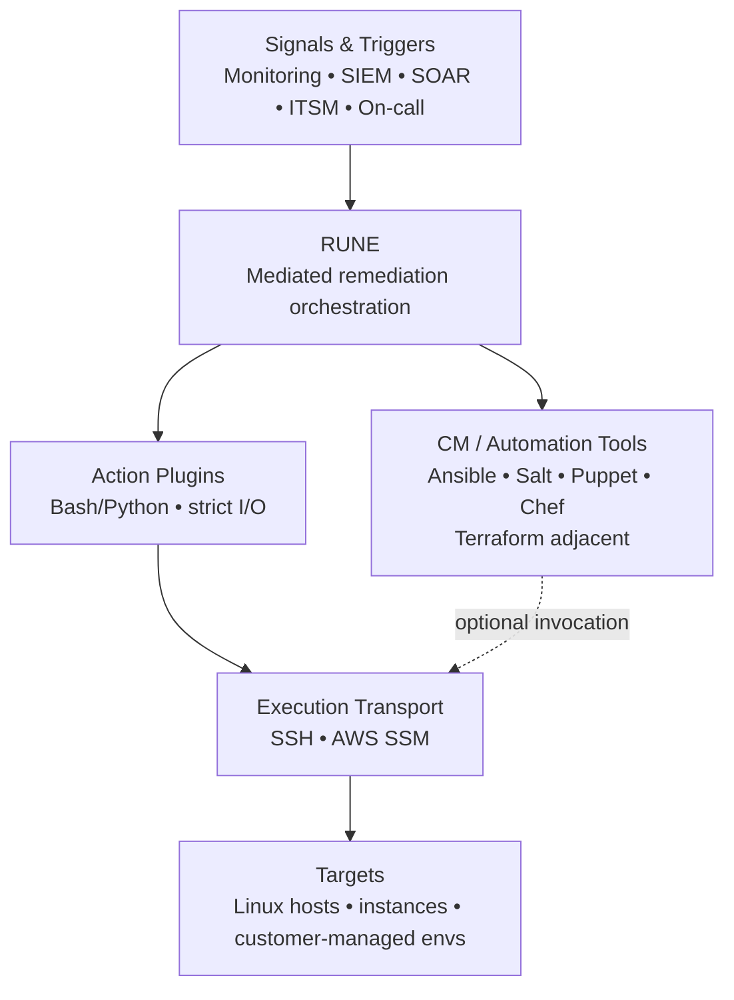

# Positioning

## What RUNE is

RUNE is an incident-driven remediation orchestrator designed for operational teams. It runs targeted actions (plugins) locally or against remote Linux hosts and returns structured results suitable for automation, auditing, and troubleshooting.

## What RUNE is not

- RUNE is not a configuration management platform.
- RUNE does not replace Ansible, Salt, Puppet, or Chef.
- RUNE does not manage desired state. It executes specific operational actions on demand.

## How RUNE complements fleet tooling

RUNE can invoke configuration or automation tools as part of a remediation action when that is the safest or most repeatable path. The core value is controlled execution, consistent outputs, and predictable error handling for incident response workflows.

## Typical use cases

- Restart or validate a critical service after an alert
- Remediate disk pressure (cleanup, rotation, expansion workflows)
- Confirm certificate or TLS configuration health
- Apply a targeted network change to restore connectivity
