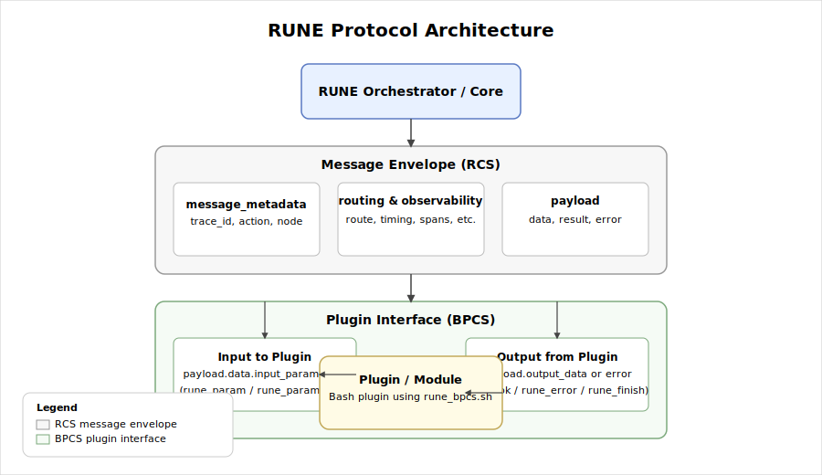

# RUNE Protocols Overview

The **RUNE Protocols** define how information moves between the RUNE Orchestrator, plugins, modules, and other internal or external components. These documents form the _contract_ between RUNE and anything that extends it.

These specifications are technical and normative. They do **not** describe how to _write_ plugins or modules, but rather how data flows, how messages are shaped, and how RUNE expects components to behave.

---

## What Is a Protocol in RUNE?

A RUNE protocol describes:

- **Message shape** (required fields, optional fields, data types)
- **Routing behavior** (where things go, how they get there)
- **Metadata conventions** (trace IDs, actions, observability fields)
- **Execution contract** (what a plugin must accept and must return)
- **Schema versioning strategy**

These protocols allow:

- Safe, automated execution of plugins
- Consistent behavior across all modules
- Traceable, auditable, and observable workflows
- Future-proof compatibility

---

## Available Protocol Specifications

### **1. BPCS — Bash Plugin Communication Specification**

Defines how Bash plugins communicate with RUNE:

- Input parsing
- Structured output expectations
- Error-handling semantics
- Schema for input parameters, metadata, routing, observability

Used by all Bash-based plugins via `rune_bpcs.sh`.

### **2. RCS — RUNE Communication Schema**

Defines the envelope and structure RUNE uses internally:

- Parent message structure
- Embedding of metadata, routing, and payload
- Cross-component communication rules

This is the foundational schema for every message RUNE processes.

### **3. Message Envelope Specification**

More detailed description of the message wrapper:

- Required fields
- Optional metadata
- Observability block
- Forwarding, replication, and transformation rules

### **4. Routing & Observability Schema**

Defines fields related to:

- Tracing
- Action lineage
- Execution timing
- Route mapping (where a message should go)

This schema is consumed by all high-level RUNE components.

---

## Who Should Read These Protocols?

These specs are essential reading for:

- Plugin developers who want deeper control
- Module authors implementing complex extensions
- RUNE contributors modifying internal message handling
- Anyone implementing a non-Bash plugin system (Python, Go, Rust, etc.)

If you're writing your first plugin, start with:

- **Developers → Plugin Development → Plugin Quickstart (Beginner)**

If you're extending RUNE's internals, see:

- **Project → Contributing → Architecture Overview**

---

## Where to Go Next

Choose the protocol you want to dive into:

- **BPCS Protocol** — How Bash plugins interact with RUNE
- **RCS Message Spec** — Unified schema for RUNE messages
- **Message Envelope Format** — Outer message structure
- **Routing & Observability Schema** — Metadata for tracing and routing

Each document provides examples, field definitions, and normative requirements.
