# Runtime Communication Specification (RCS)

This is the canonical runtime message envelope used by RUNE modules (LOM, LMM, ErrorHandler) for request correlation and routing.

For a shorter operational overview, see [Architecture](architecture.md) and [Mediation model](mediation_model.md).

## Overview

This document defines the standardized data format for all runtime communication within the RUNE platform. All operational messaging-between modules, or between modules and plugins-flows exclusively through the RUNE Mediator Module (LMM). No direct communication between modules or plugins is permitted; all interactions are strictly mediated by the LMM.

The RCS is designed for high-frequency operational messaging and prioritizes lightweight, efficient communication. For module capability declaration and registration, see the Module Registration Specification (MRS). For error handling and recovery messaging, see the Error Protocol Specification (EPS).

## Protocol Architecture Context

The RUNE platform operates on a three-protocol architecture that ensures separation of concerns and optimal performance:

| Protocol | Purpose                                        | Managed By                    | Frequency                  | Use Case                                          |
| -------- | ---------------------------------------------- | ----------------------------- | -------------------------- | ------------------------------------------------- |
| **MRS**  | Module registration and capability declaration | Orchestrator (LOM)            | Low (startup/shutdown)     | Module and plugin lifecycle management            |
| **RCS**  | Runtime operational communication              | Mediator (LMM)                | High (continuous)          | All runtime messaging between modules and plugins |
| **EPS**  | Error handling and recovery messaging          | Mediator (LMM) + ErrorHandler | Variable (exception-based) | Error responses and recovery                      |

**Architecture Principles:**

- **Mediator-Centric:** ALL runtime communication-between modules, or between modules and plugins-flows through the LMM.
- **No Direct Communication:** Modules and plugins never communicate directly with each other.
- **Plugin Mediation:** All plugin (RICI) invocation, output, and error handling is exclusively managed by the LMM.
- **Orchestrator Registry:** The LMM uses the Orchestrator's (LOM) module and plugin registry for routing decisions.
- **Protocol Separation:** Each protocol is optimized for its specific role and frequency.
- **Loose Coupling:** Changes to one module or plugin do not directly impact others.

## When to Use This Specification

| Use Case                           | Specification | Purpose                                                          |
| ---------------------------------- | ------------- | ---------------------------------------------------------------- |
| **Module-to-Module Communication** | **RCS**       | Runtime operational messaging between registered modules         |
| **Request-Response Patterns**      | **RCS**       | Synchronous and asynchronous communication workflows             |
| **Event Publishing/Subscribing**   | **RCS**       | Broadcasting events to interested modules                        |
| **Health Check Responses**         | **RCS**       | Responding to orchestrator health checks                         |
| **Business Logic Operations**      | **RCS**       | Normal processing, data transformation, notifications            |
| **Module Registration**            | **MRS**       | Declaring module capabilities and subscribing to events          |
| **Capability Updates**             | **MRS**       | Updating module event schemas or dependencies                    |
| **Error Responses**                | **EPS**       | All error conditions, validation failures, system errors         |
| **Recovery Actions**               | **EPS**       | Error escalation, module restart commands, failure notifications |

**Decision Rule:**  
Use RCS for all runtime operational communication-whether between modules, or between modules and plugins. No direct communication is allowed; the LMM is always the mediator.

**Cross-Protocol References:**

- See [Module Registration Specification (MRS)](./mrs.md) for module capability declaration.
- See [Error Protocol Specification (EPS)](./eps.md) for error handling and recovery messaging.

## Message Structure

### Complete Format Example

```json
{
  "message_metadata": {
    "version": "1.0",
    "message_id": "550e8400-e29b-41d4-a716-446655440000",
    "correlation_id": "550e8400-e29b-41d4-a716-446655440001",
    "parent_message_id": "550e8400-e29b-41d4-a716-446655440002",
    "created_at": "2025-07-31T17:47:53.123Z",
    "expires_at": "2025-07-31T17:52:53.123Z",
    "priority": "normal",
    "delivery_mode": "at_least_once"
  },
  "routing": {
    "event_type": "DATA_PROCESSED",
    "event_category": "processing",
    "source_module": "DataProcessor",
    "routing_tags": ["analytics", "batch"],
    "reply_to": {
      "event_type": "DATA_PROCESS_RESPONSE",
      "timeout_ms": 5000
    }
  },
  "payload": {
    "schema_version": "rcs_v2",
    "content_type": "application/json",
    "encoding": "utf-8",
    "size_bytes": 256,
    "checksum": "e3b0c44298fc1c149afbf4c8996fb92427ae41e4649b934ca495991b7852b855",
    "data": {
      "status": "completed",
      "records_processed": 1250,
      "processing_time_ms": 3400
    }
  },
  "quality_of_service": {
    "max_retries": 3,
    "retry_delay_ms": 1000,
    "acknowledgment_required": true,
    "dead_letter_queue": true
  },
  "security": {
    "sender_identity": "data-processor-v1.3",
    "signature": "base64-encoded-signature",
    "encryption_key_id": "key-123",
    "access_level": "internal"
  },
  "observability": {
    "trace_id": "distributed-trace-id",
    "span_id": "span-id"
  }
}
```

## Field Specifications

### Message Metadata Section

| Field               | Type            | Required | Purpose                                                                                        |
| ------------------- | --------------- | -------- | ---------------------------------------------------------------------------------------------- |
| `version`           | String          | **Yes**  | RCS protocol version for backward compatibility (current: "1.0")                               |
| `message_id`        | UUID String     | **Yes**  | Unique identifier for message deduplication and tracking                                       |
| `correlation_id`    | UUID String     | No       | Links related messages across workflow operations                                              |
| `parent_message_id` | UUID String     | No       | Creates message threading for causality tracking                                               |
| `created_at`        | RFC 3339 String | **Yes**  | Message creation timestamp in UTC (format: YYYY-MM-DDTHH:MM:SS.sssZ)                           |
| `expires_at`        | RFC 3339 String | No       | Message expiration for time-sensitive events                                                   |
| `priority`          | Enum String     | No       | Message priority: `critical`, `high`, `normal`, `low` (default: `normal`)                      |
| `delivery_mode`     | Enum String     | No       | Delivery guarantee: `at_most_once`, `at_least_once`, `exactly_once` (default: `at_least_once`) |

### Routing Section

| Field                 | Type          | Required | Purpose                                               |
| --------------------- | ------------- | -------- | ----------------------------------------------------- |
| `event_type`          | String        | **Yes**  | Primary routing key defining the service contract     |
| `event_category`      | String        | No       | Secondary classification for broad event grouping     |
| `source_module`       | String        | **Yes**  | Identity of the publishing module                     |
| `routing_tags`        | Array[String] | No       | Additional routing criteria for complex subscriptions |
| `reply_to`            | Object        | No       | Request-response pattern configuration                |
| `reply_to.event_type` | String        | No       | Expected response event type                          |
| `reply_to.timeout_ms` | Integer       | No       | Response timeout in milliseconds                      |

**Event Type Naming Convention:**

- Use past tense for completed actions: `DATA_PROCESSED`, `EMAIL_SENT`, `USER_AUTHENTICATED`
- Use present tense for commands/requests: `PROCESS_DATA`, `SEND_EMAIL`, `AUTHENTICATE_USER`
- Use noun phrases for status: `SYSTEM_STATUS`, `HEALTH_CHECK`

### Payload Section

| Field            | Type    | Required | Purpose                                                 |
| ---------------- | ------- | -------- | ------------------------------------------------------- |
| `schema_version` | String  | **Yes**  | Version of RCS protocol being used (current: "rcs_v2")  |
| `content_type`   | String  | **Yes**  | MIME type of payload content (e.g., `application/json`) |
| `encoding`       | String  | No       | Character encoding for text payloads (default: `utf-8`) |
| `size_bytes`     | Integer | **Yes**  | Payload size for validation and resource planning       |
| `checksum`       | String  | No       | SHA-256 hash for data integrity verification            |
| `data`           | Any     | **Yes**  | The actual message content                              |

### Quality of Service Section

| Field                     | Type    | Required | Purpose                                                  |
| ------------------------- | ------- | -------- | -------------------------------------------------------- |
| `max_retries`             | Integer | No       | Maximum retry attempts for failed delivery (default: 0)  |
| `retry_delay_ms`          | Integer | No       | Initial delay between retries in milliseconds            |
| `acknowledgment_required` | Boolean | No       | Whether delivery confirmation is needed (default: false) |
| `dead_letter_queue`       | Boolean | No       | Send to DLQ after max retries exceeded (default: false)  |

### Security Section

| Field               | Type        | Required | Purpose                                                                     |
| ------------------- | ----------- | -------- | --------------------------------------------------------------------------- |
| `sender_identity`   | String      | No       | Authenticated sender identifier                                             |
| `signature`         | String      | No       | Digital signature for message integrity                                     |
| `encryption_key_id` | String      | No       | Reference to encryption key if payload is encrypted                         |
| `access_level`      | Enum String | No       | Security classification: `public`, `internal`, `restricted`, `confidential` |

### Observability Section

| Field      | Type   | Required | Purpose                        |
| ---------- | ------ | -------- | ------------------------------ |
| `trace_id` | String | No       | Distributed tracing identifier |
| `span_id`  | String | No       | Tracing span identifier        |

## Error Handling

RCS does not define error message formats. All error responses use the Error Protocol Specification (EPS) format.

When RCS message processing encounters errors, the response follows EPS format instead of RCS format. Common error scenarios include:

### When EPS is Used Instead of RCS

| Error Condition        | Protocol Used | Handling Component |
| ---------------------- | ------------- | ------------------ |
| JSON parse failure     | **EPS**       | Mediator           |
| Schema validation fail | **EPS**       | Mediator           |
| Module not found       | **EPS**       | Mediator           |
| Message timeout        | **EPS**       | Mediator           |
| Business logic error   | **EPS**       | Target Module      |
| System resource error  | **EPS**       | System Monitor     |

### Error Response Flow


**For complete error handling specifications, see:** [Error Protocol Specification (EPS)](./eps.md)

## Minimal Required Message

The absolute minimum valid message contains only required fields:

```json
{
  "message_metadata": {
    "version": "1.0",
    "message_id": "550e8400-e29b-41d4-a716-446655440000",
    "created_at": "2025-07-31T17:47:53.123Z"
  },
  "routing": {
    "event_type": "SYSTEM_HEARTBEAT",
    "source_module": "SystemMonitor"
  },
  "payload": {
    "schema_version": "rcs_v2",
    "content_type": "application/json",
    "size_bytes": 25,
    "data": {
      "status": "healthy"
    }
  }
}
```

## Example Implementation: Logging Module

Here's an example of how a logging module would use the RCS format:

```json
{
  "message_metadata": {
    "version": "1.0",
    "message_id": "770e8400-e29b-41d4-a716-446655440123",
    "correlation_id": "workflow-abc-123",
    "created_at": "2025-07-31T17:47:53.456Z",
    "priority": "high"
  },
  "routing": {
    "event_type": "LOG_MESSAGE",
    "event_category": "logging",
    "source_module": "SecurityScanner",
    "routing_tags": ["security", "audit", "authentication"]
  },
  "payload": {
    "schema_version": "rcs_v2",
    "content_type": "application/json",
    "size_bytes": 189,
    "data": {
      "log_level": "WARNING",
      "message": "Failed login attempt detected",
      "timestamp": "2025-07-31T17:47:53.456Z",
      "details": {
        "username": "admin",
        "source_ip": "192.168.1.100",
        "attempt_count": 3,
        "user_agent": "Mozilla/5.0..."
      }
    }
  },
  "security": {
    "access_level": "restricted"
  },
  "observability": {
    "trace_id": "auth-trace-456",
    "span_id": "login-validation-span"
  }
}
```

## Implementation Notes

1. **Timestamps**: All timestamps must be in RFC 3339 format with UTC timezone (YYYY-MM-DDTHH:MM:SS.sssZ)
2. **UUIDs**: Use UUID v4 for all identifier fields
3. **Checksums**: Use SHA-256 for payload integrity verification
4. **Size Validation**: `size_bytes` must match actual payload size
5. **Extensibility**: Additional fields may be added to any section without breaking compatibility
6. **Protocol Version**: This is RCS version 1.0. The `version` field in `message_metadata` refers to the RCS protocol version
7. **Schema Version**: The `schema_version` field in payload refers to RCS protocol version (current: "rcs_v2")
8. **Relationship to Other Protocols**:
   - Module capabilities declared using MRS format
   - Runtime communication uses RCS format
   - Error responses use EPS format
9. **Communication Architecture**: All messages flow through Mediator; no direct module-to-module communication
10. **Registry Integration**: Mediator uses Orchestrator's module registry for routing decisions

This format ensures robust, secure, and observable inter-module communication while maintaining the flexibility required for future system evolution.

## Example: Memory Check Workflow Communication

The following mermaid diagram visually reinforces that all plugin interactions (invocation, output, errors) are mediated by the LMM:

```mermaid
flowchart TD
    Start([Start Workflow]) --> O["🎯 Orchestrator (LOM)"]

    O -->|Execute Script| M["⚡ Mediator (LMM)"]
    M --> SE["🔧 Plugin: ScriptExecutor"]

    SE -->|Log Start| M
    M --> LM1["📝 Logger"]

    SE -->|Return Results| M
    M --> O

    SE -->|Log Results| M
    M --> LM2["📝 Logger"]

    O -->|Log Complete| M
    M --> LM3["📝 Logger"]

    LM3 --> EndNode([End Workflow])

    classDef orchestrator fill:#e1f5fe,stroke:#0277bd,stroke-width:2px
    classDef mediator fill:#f3e5f5,stroke:#7b1fa2,stroke-width:2px
    classDef plugin fill:#e8f5e8,stroke:#2e7d32,stroke-width:2px
    classDef logger fill:#fff3e0,stroke:#ef6c00,stroke-width:2px

    class O orchestrator
    class M mediator
    class SE plugin
    class LM1,LM2,LM3 logger
```



### Key Framework Features Demonstrated

#### 1. Mediator Pattern

- All communication flows through the Mediator.
- Modules never communicate directly with each other.
- Event-type based routing (`EXECUTE_SCRIPT`, `LOG_MESSAGE`, `SCRIPT_EXECUTED`).

#### 2. Service Abstraction

- Orchestrator doesn't know which specific script execution module handles the request.
- Any module subscribing to `EXECUTE_SCRIPT` could fulfill the request.
- Logging is handled by event type, not module name.

#### 3. Message Threading

- `correlation_id` links all messages in the workflow.
- `parent_message_id` shows message causality.
- `trace_id` enables distributed tracing across the entire workflow.

#### 4. Loose Coupling

- Script Executor could be swapped for a different implementation.
- Logging Module could be replaced with a different logging service.
- Orchestrator remains unchanged regardless of underlying implementations.

#### 5. Observable Workflow

- Complete audit trail through logging.
- Tracing support for performance analysis.
- Error handling and timeout management built-in.

This example shows how the event-driven architecture enables complex workflows while maintaining modularity, observability, and the ability to swap service implementations without affecting other components.
