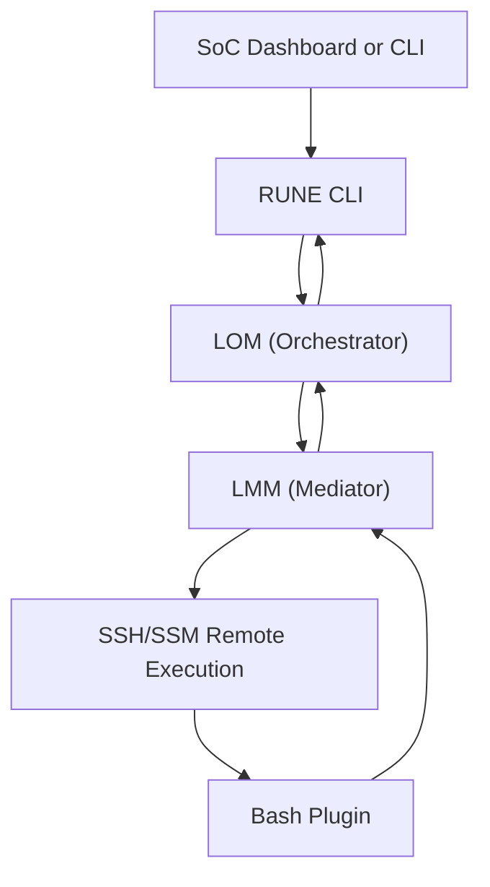

# RUNE System Architecture

This document provides a high-level view of RUNE's core components and their interaction during plugin execution. This MVP design favors clarity, modularity, and minimal surface area for deployment.

---

## High-Level Architecture (MVP)

---

## Components

### CLI

- Primary entrypoint for users and systems
- Parses commands, invokes LOM

### LOM – Lifecycle Orchestrator Module

- Validates requested action
- Selects appropriate plugin
- Delegates execution to LMM

### LMM – Local Mediation Module

- Handles all plugin execution and communication
- Ensures JSON payload validity and formatting
- Routes structured success/failure messages back to LOM

### Remote Execution

- Agentless invocation via:

  - SSH with `bash -s`
  - AWS SSM send-command (optional)

### Plugins (Remote Scripts)

- Perform the requested task
- Conform to Bash Plugin Communication Spec (BPCS)
- Must produce structured JSON and exit codes

---

## Message Protocols

| Purpose         | Spec                  |
| --------------- | --------------------- |
| Action Request  | RCS (Runtime Comm)    |
| Registration    | MRS (Module Registry) |
| Error Reporting | EPS (Error Protocol)  |

---

## Observability Hooks

- All actions return structured JSON
- stdout: primary channel for result object
- stderr: reserved for debug, logging, or trace IDs
- Optional: logs/telemetry shipped to centralized sink

---

## Design Notes

- All modules are decoupled and replaceable
- No direct plugin-to-plugin interaction
- Core system is Python-based; plugins can be any language that conforms to the protocol
- Architecture supports eventual transition to event-driven workflows without overhaul

© 2025 Richard Majewski. Licensed under the MPL-2.0.
